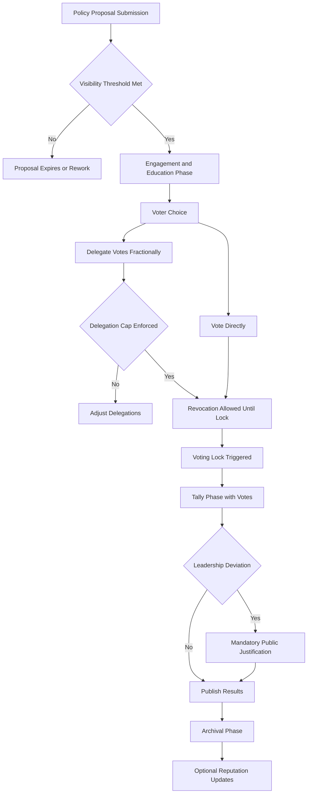

# [[David Foster Wallace]]

---
Date Created: "2025-04-27 11:15"
Last Updated: "2025-04-27 11:15"
tags:
  - Resource
Index: 
Topic: 
Link: 
Status: Unweathered
Published: true
---
---


# [[Palmer Luckey]]

---
Date Created: "2025-04-27 10:57"
Last Updated: "2025-04-27 10:57"
tags:
  - Resource
Index: 
Topic: 
Link: 
Status: Unweathered
Published: true
---
---
## The AI Arsenal That Could Stop World War III | Palmer Luckey | TED
https://www.youtube.com/watch?v=ooMXEwl7N8Y

- Pointed out what I'm thinking, we have SO much tech at our fingertips, can just use it lmao.
- Androl
	- Defence (bleh), but good philosophy
	- "We use our money, not taxpayers"
- AI platform called Lattice
	- IOT connected everything
- Super quick timeframe
- Need to yap with them abt AR tech for education
- "At our core we're about fostering peace"
	- Publicity = deterrance
	- "sabre rattling"
- China has the neumerical advantage
	- "We need fundamentally different stratagies"
	- "Mass production matters"
- "We don't want to throw millions of people into the fight"
	- We shouldn't!!!
- "They won't be concerned with our ethical norms"
	- For my tech we shouldn't either lmao (scihub rant)

Q/A
- On AI: "Humans building tools to remove decisions is not a new concept"
	- Pit traps etc.
	- "No moral highground to refusing to use the tech that can determine the difference between a schoolbus full of children and russain armor"
- Remote control: 1-1 ratio
	- Also breaking remote -> jamming = instant win
- Autonomous defence has been a thing for a hot minute
	- "Not opening pandoras box, you're requesting for us to close it!"
- "We need to see the world like robots do if we're going to be working closely along-side them."
	- I FW that sentiment; but to my application lmaoooo
	- Imma let them do their defence shit but I wanna attack the problem from a different angle
		- There is a war within our country already being fought, a war on public misinformation.


## Reflection
### Curiosities
- 

### Ideas
- 

### Misc. Notes
- 

### Questions
- 


# [[Steve Jobs]]

---
Date Created: 2025-04-26 16:28
Last Updated: 2025-04-26 16:28
tags:
  - Resource
Index: 
Topic:
  - "[[The Archive Eternal]]"
Link: 
Status: Unweathered
Published: true
---
---
## The Start of an Obsession

### https://www.youtube.com/watch?v=cHuqhQmc4ok

UGHHHH, I wish I could have a conversation with this guy.

> "There are seven-year-old kids today playing with macroeconomic models. You can debate the content of those models, but one thing is undeniable: these kids will sit for hours, learning and experimenting through play. We need to keep improving our models—making them more sophisticated—but this kind of interactive learning is something none of us had growing up. Thousands of individual experiences are being built, all grounded in a shared set of core principles."

"The problem was you can't ask Aristotle a question."

Did steve jobs journal?? If so we need to get an AI of this mf STAT;; quite curious if this is achievable. Like off all of the content online of his essence


### https://book.stevejobsarchive.com/


## https://www.youtube.com/watch?v=1lEnMmH9qh4

Steve Jobs @ MIT 1992 - "What's the most important thing that you personally learned at Apple...?"

>"That's a great question. I'm not sure I learned this directly at Apple, but I came to realize it there through experience and reflection. The biggest lesson was this: I now take a much longer-term view on people. In the past, when I saw something being done wrong, my first instinct was to step in and fix it immediately. Now, instead of focusing on fixing the problem myself, I think about how to build a stronger team for the long run — not just for the next year, but for the next decade. So the question I ask myself is: _What can I do to help this person learn and grow,_ rather than _how do I solve this problem right now?_ It's not always easy. That impulse to jump in and fix things is still there. But exercising patience, and investing in the growth of others, has probably been the most profound shift in my mindset. And honestly, some part of that change might just be biological — the result of time, experience, and maturing as a leader."


## https://www.youtube.com/watch?v=UF8uR6Z6KLc

Steve Jobs' 2005 Stanford Commencement Address

```markdown

**Introduction**:

- Gratitude and humility: did not graduate, honored to be present.
    
- Setup: Will tell three simple stories.
    

**Story 1 – Connecting the Dots**:

- Adoption circumstances and college beginnings.
    
- Dropping out to follow intuition.
    
- Learning calligraphy at Reed College.
    
- How seemingly random events led to innovation at Apple.
    
- Moral: You cannot connect the dots looking forward, only looking backward. Trust in something.
    

**Story 2 – Love and Loss**:

- Founding Apple and early success.
    
- Getting fired and its devastation.
    
- Discovering renewed creativity: NeXT, Pixar, marriage.
    
- Return to Apple stronger.
    
- Moral: Find what you love. Never settle.
    

**Story 3 – Death**:

- Reflection on mortality starting at 17.
    
- Cancer diagnosis and near-death experience.
    
- Deep realization: time is limited, live authentically.
    
- Moral: Follow your heart and intuition. Everything else is secondary.
    

**Closing – Stay Hungry, Stay Foolish**:

- The Whole Earth Catalog.
    
- Final farewell blessing to the graduates.
    
```


```

Thank you.  
I am deeply honored to be with you today for your commencement from one of the finest universities in the world.

Truth be told, I never graduated from college.  
This is the closest I've ever come to a college graduation.

Today, I want to share three stories from my life. That's it. No big deal — just three simple stories.

---

#### First Story: Connecting the Dots

I dropped out of Reed College after six months but stayed around as a drop-in for about 18 more months before truly leaving.

Why did I drop out?  
The story begins before I was even born.  
My biological mother, a young, unwed graduate student, decided to put me up for adoption. She insisted I be adopted by college graduates. Everything was set — until the adoptive couple backed out because they wanted a girl.

In the middle of the night, my future parents — neither of whom graduated college — were offered a baby boy. They said yes. My biological mother only agreed to the adoption after they promised that I would go to college someday.

Seventeen years later, I did.  
But I naively chose a college almost as expensive as Stanford, spending all my working-class parents' savings.  
After six months, I couldn’t see the value.  
I had no idea what I wanted to do with my life — and no idea how college would help.  
So I dropped out, trusting that things would somehow work out.

It was terrifying.  
I slept on friends' floors, returned Coke bottles for food money, and walked seven miles for a good meal once a week at the Hare Krishna temple.

Yet following my curiosity turned out to be priceless.  
For example, Reed College had the best calligraphy instruction in the country.  
Because I was no longer taking required classes, I took a course in calligraphy, learning about typefaces, spacing, and the beauty of typography.

At the time, none of it had any practical application.

But ten years later, when designing the first Macintosh, it all came back.  
The Mac became the first computer with beautiful typography — and, since Windows copied the Mac, every personal computer owes something to that calligraphy class.

You cannot connect the dots looking forward; you can only connect them looking backward.  
So you must trust that the dots will connect in your future.  
Trust in something — your gut, destiny, karma, life — because believing the dots will connect will give you the confidence to follow your heart, even when it leads you off the well-worn path.

And that will make all the difference.

---

#### Second Story: Love and Loss

I was lucky — I found what I loved to do early.  
Woz and I started Apple in my parents’ garage when I was 20.  
In 10 years, Apple grew into a $2 billion company with over 4,000 employees.  
We had just released the Macintosh and I had just turned 30.

Then I got fired.

How do you get fired from a company you started?  
As Apple grew, we hired someone to help run it, and at first, things went well.  
But our visions diverged, and eventually the Board of Directors sided with him.

I was out — very publicly out.  
It was devastating.  
For months, I didn't know what to do.  
I felt like I had let the previous generation of entrepreneurs down.  
I even thought about leaving Silicon Valley altogether.

But something slowly dawned on me:  
I still loved what I did.  
I had been rejected, but I was still in love.

So I started over.

Over the next five years, I founded NeXT, founded Pixar, and fell in love with an amazing woman who became my wife.  
Pixar went on to create _Toy Story_, the first computer-animated feature film, and became the most successful animation studio in the world.

In a remarkable turn of events, Apple bought NeXT, and I returned — the technology we built at NeXT now powers Apple’s renaissance.

None of this would have happened if I hadn't been fired.  
It was awful-tasting medicine, but I guess the patient needed it.

Sometimes life hits you in the head with a brick. Don’t lose faith.

The only thing that kept me going was that I loved what I did.  
You must find what you love — and that goes for your work as well as your relationships.  
Your work is going to fill a large part of your life, and the only way to be truly satisfied is to do what you believe is great work.  
And the only way to do great work is to love what you do.

If you haven’t found it yet, keep looking.  
Don’t settle.  
As with all matters of the heart, you’ll know when you find it.  
And like any great relationship, it only gets better with time.

So keep looking. Don’t settle.

### Steve Jobs on Death and Following Your Heart

**My third story is about death.**

> When I was 17, I read a quote that went something like: "If you live each day as if it was your last, someday you'll most certainly be right."  

It made an impression on me, and since then, for the past 33 years, I have looked in the mirror every morning and asked myself: "If today were the last day of my life, would I want to do what I am about to do today?"

And whenever the answer has been "No" for too many days in a row, I know I need to change something.

Remembering that I'll be dead soon is the most important tool I've ever encountered to help me make the big choices in life. Because almost everything – all external expectations, all pride, all fear of embarrassment or failure – these things just fall away in the face of death, leaving only what is truly important.

Remembering that you are going to die is the best way I know to avoid the trap of thinking you have something to lose. You are already naked. There is no reason not to follow your heart.

About a year ago I was diagnosed with cancer. I had a scan at 7:30 in the morning, and it clearly showed a tumor on my pancreas. I didn't even know what a pancreas was. The doctors told me this was almost certainly a type of cancer that is incurable, and that I should expect to live no longer than three to six months.

My doctor advised me to go home and get my affairs in order, which is doctor's code for prepare to die. It means to try to tell your kids everything you thought you'd have the next 10 years to tell them in just a few months. It means to make sure everything is buttoned up so that it will be as easy as possible for your family. It means to say your goodbyes.  

I lived with that diagnosis all day. Later that evening I had a biopsy, where they stuck an endoscope down my throat, through my stomach and into my intestines, put a needle into my pancreas and got a few cells from the tumor. I was sedated, but my wife, who was there, told me that when they viewed the cells under a microscope the doctors started crying because it turned out to be a very rare form of pancreatic cancer that is curable with surgery. I had the surgery and thankfully I'm fine now.

This was the closest I've been to facing death, and I hope it's the closest I get for a few more decades. Having lived through it, I can now say this to you with a bit more certainty than when death was a useful but purely intellectual concept:

No one wants to die. Even people who want to go to heaven don't want to die to get there. And yet death is the destination we all share. No one has ever escaped it. And that is as it should be, because Death is very likely the single best invention of Life. It is Life's change agent. It clears out the old to make way for the new. Right now the new is you, but someday not too long from now, you will gradually become the old and be cleared away. Sorry to be so dramatic, but it is quite true.

**Your time is limited, so don't waste it living someone else's life. Don't be trapped by dogma – which is living with the results of other people's thinking. Don't let the noise of others' opinions drown out your own inner voice. And most important, have the courage to follow your heart and intuition. They somehow already know what you truly want to become. Everything else is secondary.**  

### Steve Jobs on the Whole Earth Catalog and Staying Foolish

When I was young, there was an amazing publication called _The Whole Earth Catalog_, which was one of the bibles of my generation. It was created by a fellow named Stewart Brand not far from here in Menlo Park, and he brought it to life with his poetic touch. This was in the late 1960s, before personal computers and desktop publishing, so it was all made with typewriters, scissors, and Polaroid cameras. It was sort of like Google in paperback form, 35 years before Google came along: it was idealistic, overflowing with neat tools, and great notions.  

Stewart and his team put out several issues of _The Whole Earth Catalog_, and then when it had run its course, they put out a final issue. It was the mid-1970s, and I was your age. On the back cover of their final issue was a photograph of an early morning country road, the kind you might find yourself hitchhiking on if you were so adventurous. Beneath it were the words: **"Stay Hungry. Stay Foolish."**  

It was their farewell message as they signed off. Stay Hungry. Stay Foolish. And I have always wished that for myself. And now, as you graduate to begin anew, I wish that for you.  

**Stay Hungry. Stay Foolish.**

Thank you all very much.

```


## Steve Jobs on Consulting
https://www.youtube.com/watch?v=-c4CNB80SRc

```markdown
Many of you come from companies where you've already gained work experience, right?  
How many are from manufacturing companies?  
_(Audience responds.)_  
Excellent. Where are the rest of you from?

How many from consulting?  
_(Audience responds.)_  
Ah, that's not ideal.

No, seriously — I don’t think consulting is inherently bad. It’s not evil.  
But without owning something — owning a project or product over an extended period of time, across multiple stages — you miss out on a lot of real learning.

You need the experience of making decisions, seeing your recommendations implemented, dealing with the consequences — the mistakes, the setbacks — and picking yourself back up. You need to accumulate the _scar tissue_ that only comes from living through the whole cycle.

When you're consulting, you might make recommendations, but you don't typically own the results. You don't own the implementation. That limits the depth of what you can learn.

Consulting gives you a broad exposure to companies — but it’s very thin. It’s like looking at a picture of a banana.

You might have a very accurate, detailed photo, but it’s still only two-dimensional. Without actually doing it — without the hands-on experience — you never truly grasp the three-dimensional reality.

So, you may end up with a lot of pictures to hang on your wall — "I've worked in bananas, I've worked in peaches, I've worked in grapes" — but you never really taste any of them.

And one more thing: as a consultant, you're a variable expense.  
In tough times, companies often start by cutting variable expenses.

Just something to keep in mind.
```


## Steve Jobs Secrets of Life
https://www.youtube.com/watch?v=kYfNvmF0Bqw

```markdown
". . . The thing I would say is, when you grow up, you tend to get told that the world is the way it is, and your life is just to live your life inside the world. Try not to bash into the walls too much. Try to have a nice family life, have fun, save a little money. But life, that's a very limited life. Life can be much broader once you discover one simple fact, and that is: Everything around you that you call life was made up by people that were no smarter than you. And you can change it. You can influence it. You can build your own things that other people can use. And the minute that you understand that you can poke life, and actually something will, you know, if you push in, something will pop out the other side, that you can change it. You can mold it. That's maybe the most important thing is to shake off this erroneous notion that life is there and you're just going to live in it, versus embrace it. Change it. Improve it. Make your mark upon it. I think that's very important. And however you learn that, once you learn it, you'll want to change life and make it better. Because it's kind of messed up in a lot of ways. Once you learn that, you'll never be the same again."
```


## Steve jobs most innovative speech
https://www.youtube.com/watch?v=YM4If6YHN3s


# [[CTF Games]]

https://bellard.org/jslinux/vm.html?cpu=riscv64&url=fedora33-riscv.cfg&mem=256
![[Pasted image 20250421193424.png]]
![[Pasted image 20250421193418.png]]

## Reflection
### Curiosities
- 

### Ideas
- 

### Misc. Notes
- 

### Questions
- 

## Reflection
### Curiosities
- 

### Ideas
- 

### Misc. Notes
- 

### Questions
- 


**Concept**: Earth is hot. Space is cold. Therein lies a thermodynamic gradient—a planetary-scale energy opportunity waiting to be harvested. 

> Aside as clarification of methodologies: 
> **Concept**: Earth is hot. Space is cold. Therein lies a thermodynamic gradient—a planetary-scale energy opportunity waiting to be harvested. Except—let's be clear—space is not a sink in the traditional thermodynamic sense. It lacks matter to carry away heat through conduction or convection. Radiative heat transfer is our only option. This limits our theoretical efficiency and demands we get creative.
> 
> The concept as initially imagined was flawed: that a space elevator or ring could _passively_ dump heat into the cold of space. But the vacuum doesn’t take heat—it simply allows it to escape, **very slowly**, unless we engineer the systems to do so. The updated vision pivots from heat diffusal alone to a hybrid approach combining passive radiation, high-efficiency thermoelectric conversion, and active heat transport via charged particles or radiators.
> 
> Relevant research such as ["Thermodynamic limits for simultaneous energy harvesting from the hot sun and cold outer space"](https://www.nature.com/articles/s41377-020-0296-x) outlines the theoretical boundaries of such systems. Furthermore, NASA's advancements in space-based radiator technology ([thermal control systems](https://www.nasa.gov/smallsat-institute/sst-soa/thermal-control/)) offer paths forward.
> 
> The orbital ring concept still has enormous potential—not only as a site for thermoelectric conversion where sunlight is constant and ambient temperatures are controllable, but as a staging ground for moving computation and even advanced manufacturing off-Earth. By relocating heat-intensive processes into orbit, we reduce planetary heat load _and_ gain efficiencies in solar capture.
> 
> The key becomes optimization: angle-aligned radiators, high-emissivity materials, active thermal pumping systems, and radiation-assisted cooling strategies that treat orbital altitude as a staging ground, not a dumping ground.
> 
> We are only a little crazy for thinking this can work. But this "insanity" we like to call "imagination", the precursor to revolutionary advances in our technology.

This principle—turning environmental excess into utility—can underpin not only a technological revolution, but a sociopolitical realignment centered on collaboration and shared planetary destiny.


# [[MetaGov Knowledge Organization Infrastructure]]

---
Date Created: "2025-04-27 15:56"
Last Updated: "2025-04-27 15:56"
tags:
  - Resource
Index: 
Topic: 
Link: 
Status: Unweathered
Published: true
---
---
## Summary:
Knowledge Organization Infrastructure initiative run by MetaGov in collaboration with Blockscience earlier this year. I need to catch up lmao

## Key Terms:
* KOI - Knowledge Organization Infrastructure
	* Knowledge in both the literal sense and comp-sci sense (knowledge on the node level)

## References:
List collated by Jess at BSciRelated articles:  
[https://blog.block.science/koi-network-protocol-project-interlay/](https://blog.block.science/koi-network-protocol-project-interlay/)  
[https://blog.block.science/architecting-knowledge-organization-infrastructure/](https://blog.block.science/architecting-knowledge-organization-infrastructure/)  
	[[OSA Community event Architecting Organizational Knowledge w  Michael Zargham]]
[https://blog.block.science/a-language-for-knowledge-networks/](https://blog.block.science/a-language-for-knowledge-networks/)  
[https://blog.block.science/knowledge-networks-and-the-politics-of-protocols/](https://blog.block.science/knowledge-networks-and-the-politics-of-protocols/)  
[https://blog.block.science/objects-as-reference-toward-robust-first-principles-of-digital-organization/](https://blog.block.science/objects-as-reference-toward-robust-first-principles-of-digital-organization/)  
[https://blog.block.science/from-networks-of-computers-to-network-computers-and-beyond/](https://blog.block.science/from-networks-of-computers-to-network-computers-and-beyond/)YouTube Playlist:  
[https://www.youtube.com/watch?v=zTaK09Lo94A&list=PLmWm8ksQq4YLHvyVUimsYhF5lANBmRIbQ](https://www.youtube.com/watch?v=zTaK09Lo94A&list=PLmWm8ksQq4YLHvyVUimsYhF5lANBmRIbQ)

BlockScience Blog

[KOI Network Protocol & Interlay | Research & Development](https://blog.block.science/koi-network-protocol-project-interlay/)

Video: Digital Infrastructure research & development for decentralized & interoperable knowledge systems: KOI Network Protocol x Project Interlay.

Written by

BlockScience

Filed under

Knowledge Organization Infrastructure, Knowledge Networks

Mar 24th

[https://blog.block.science/koi-network-protocol-project-interlay/](https://blog.block.science/koi-network-protocol-project-interlay/ "KOI Network Protocol &amp; Interlay | Research &amp; Development")

[](https://blog.block.science/koi-network-protocol-project-interlay/)

BlockScience Blog

[Architecting Knowledge Organization Infrastructure](https://blog.block.science/architecting-knowledge-organization-infrastructure/)

Watch Dr. Zargham present a systems engineering perspective on how we design, implement, operate & govern knowledge organization infrastructures.

Written by

BlockScience

Filed under

Knowledge Management, Knowledge Organization Infrastructure

Dec 19th, 2024 (76 kB)

[https://blog.block.science/architecting-knowledge-organization-infrastructure/](https://blog.block.science/architecting-knowledge-organization-infrastructure/ "Architecting Knowledge Organization Infrastructure")

[](https://blog.block.science/architecting-knowledge-organization-infrastructure/)

BlockScience Blog

[Language for Knowledge Networks | Research & Development](https://blog.block.science/a-language-for-knowledge-networks/)

Developing digital infrastructure to support conversations between organizations & enable small specialized firms to outcompete large institutions.

Written by

BlockScience

Filed under

Knowledge Management, Management Infrastructure, Cybernetics, LLM, Knowledge Networks, Digital Infrastructure, Information Infrastructure

Aug 31st, 2023

[https://blog.block.science/a-language-for-knowledge-networks/](https://blog.block.science/a-language-for-knowledge-networks/ "Language for Knowledge Networks | Research &amp; Development")

[](https://blog.block.science/a-language-for-knowledge-networks/)

BlockScience Blog

[Knowledge Networks & the Politics of Protocols | Research & Development](https://blog.block.science/knowledge-networks-and-the-politics-of-protocols/)

Research & Open-Source Software Development: building tools that allow users to provision, operate, maintain, & govern instances of an application.

Written by

BlockScience

Filed under

Knowledge Networks, LLM, BlockScience, Knowledge Management, Information Infrastructure, Digital Infrastructure

Jan 9th, 2024 (2 MB)

[https://blog.block.science/knowledge-networks-and-the-politics-of-protocols/](https://blog.block.science/knowledge-networks-and-the-politics-of-protocols/ "Knowledge Networks &amp; the Politics of Protocols | Research &amp; Development")

[](https://blog.block.science/knowledge-networks-and-the-politics-of-protocols/)

BlockScience Blog

[Objects as Reference: First Principles of Digital Organization](https://blog.block.science/objects-as-reference-toward-robust-first-principles-of-digital-organization/)

Towards first principles to guide, develop & understand new forms of digital organization & cyber-infrastructure in terms of objects as reference.

Written by

BlockScience

Filed under

Information Infrastructure, Knowledge Management, Research, BlockScience, Digital Infrastructure

Nov 13th, 2023


# [[Philosophical Schools of Thought]]

---
Date Created: 2025-04-22 11:13
Last Updated: 2025-04-22 11:13
tags:
  - Area
Index: 
Topic: 
Status: Unweathered
Published: true
Author:
---
---

See [[Philosophical Schools of Thought]] for how they could be integrated simultaniously.

Adam and I had a conversation on [[2025-04-21 -  ADAM MIRI (texted and recorded notes)]]
## Raw Notes:


![[20250416_112227.jpg]]

![[20250416_112230.jpg]]

![[20250416_112236.jpg]]

![[20250416_112240.jpg]]

![[20250416_112245.jpg]]

![[20250416_112251.jpg]]


## Raw Notes:


![[20250416_112257.jpg]]

![[20250416_112301.jpg]]


## Raw Notes

![[The Arx Foundation（1）.png]]

![[The Arx Foundation（2）.png]]

![[The Arx Foundation（3）.png]]

![[The Arx Foundation（4）.png]]

![[The Arx Foundation（5）.png]]

![[The Arx Foundation（6）.png]]

## Typed notes:

![[The Arx Foundation（7）.png]]

![[The Arx Foundation（8）.png]]

![[The Arx Foundation（9）.png]]

![[The Arx Foundation（10）.png]]

![[The Arx Foundation（11）.png]]

![[The Arx Foundation（12）.png]]

![[The Arx Foundation（13）.png]]

![[The Arx Foundation（14）.png]]

![[The Arx Foundation（15）.png]]

![[The Arx Foundation（16）.png]]

![[The Arx Foundation（17）.png]]

![[The Arx Foundation（18）.png]]


# [[Building a Better Future Through Business and AI Application]]

---
Date Created: 2025-04-27 18:37
Last Updated: 2025-04-27 18:37
  - Project
Status: Unweathered
Published: true
Author:
---
---

### Call for Submissions

Artificial intelligence (AI) has emerged as a transformative force, reshaping industries, economies, and societies at an unprecedented pace. The exponential growth of AI technologies offers new opportunities and challenges for businesses worldwide, enabling enhanced decision-making, efficiency, and innovation. We believe AI will be a critical piece of new ventures that will develop products and services that change the world. At Mays, we are committed to supporting AI’s capabilities to produce new products and services that build a better future.

To that end, Texas A&M University’s Mays Business School — in collaboration with the College of Engineering, the College of Arts and Sciences, the College of Architecture, the College of Agriculture and Life Sciences, and Texas A&M Innovation — invites individuals and teams of undergraduate student founders nationwide to submit business plans that leverage AI to address real-world challenges. Eligible individuals and teams must be currently enrolled undergraduate student founders from any major at any university and no more than four members can be on one team.

From the business plans submitted to the competition, judges will identify the top 24 entries. Those individuals and teams will be invited to present a 10-minute pitch to a panel of three judges through a virtual format. From those 24 entries, the judges will identify the top 12 nationwide and they will be invited to come to College Station for a final in-person pitch.

Submissions are due April 30, 2025.

Mays is proud to have support for the competition from Deloitte* and the Deloitte Foundation through individual contributions from Deloitte Texas A&M alumni matched by the Deloitte Foundation.

**Interested in learning more? Submit your information below to receive competition updates and support with your AI business plan.**

Name(Required)

FirstLast

Email(Required)

Name of University(Required)

I am a...(Required)

StudentFaculty MemberOther



Questions or Comments

#### **Competition Overview**

The competition will highlight the best AI-related businesses from undergraduate student founders across the country. Individuals and teams will compete in three rounds:

- Written Business Plan Round: Submit written business plans to Mays Business School by April 30, 2025.
- Virtual Pitch Round: 24 entries will be selected from all submissions to present a 10-minute pitch virtually in June 2025.
- Final Round of In-Person Pitches: The top 12 entries will advance to compete at Mays Business School at Texas A&M University in College Station, Texas, on Sept. 19-20, 2025.

Winners will receive significant cash prizes, including $100,000 for first place, $50,000 for second place, and $25,000 for third place.

#### **Eligibility**

- All individuals and teams must be undergraduate students currently enrolled at an accredited U.S. university
- Students from all undergraduate majors are eligible to participate
- Business plans must feature AI as a central component of their venture
- Individuals and teams must demonstrate ownership or full rights to any technology or intellectual property used in their business plan
- Ventures cannot have raised more than $250,000 in equity capital prior to Jan. 1, 2025
- The ventures cannot have generated more than $100,000 in gross revenue in any 12-month period prior to Jan. 1, 2025
- Ventures must have a minimum viable product (MVP)

#### **Submission Information**

Individuals and teams are required to submit a business plan that does not exceed 15 pages (including appendices and exhibits) and that includes the following:

- Executive Summary: Overview of the business plan
- AI Integration: Explanation of how AI is central to the venture
- Market Opportunity: Analysis of the target market and potential demand
- Revenue Model: Description of how the business will generate revenue
- Team Overview: Information about the individual team members and their roles
- Financial Projections: Summary of expected financial outcomes

MVP is not required for your initial submission. In June, we will ask the top 24 entries to share their MVPs.

[Submit Your Business Plan](https://createdatmays.tamu.edu/ai-undergrad-competition/undergraduate-competition-submission-form/)

#### Evaluation

Submissions will be reviewed by industry experts and Texas A&M faculty experts based on:

- Innovation: Original, creative, and effective use of AI technologies
- Market Potential: Scalable idea that demonstrates clear understanding of customer needs
- Feasibility: Viable business model with realistic financial projections
- Impact: Addresses significant societal challenges and contributes to building a better future through AI

##### [Evaluation Criteria](https://createdatmays.tamu.edu/blogs/2025/02/ai-undergraduate-competition/#c9762b5e5d7dc6f77)

**Innovation and Creativity (25%)**

- _Originality_: Assess whether the business concept introduces a novel solution or approach within its industry.
- _AI Integration_: Evaluate how effectively AI technologies are incorporated into the product or service, and the uniqueness of this application.  
    

**Market Potential and Opportunity (20%)**

- _Market Analysis_: Determine the depth of understanding of the target market, including size, growth potential, and customer segmentation.
- _Competitive Advantage_: Analyze the venture’s differentiation from existing competitors and its strategy for achieving a sustainable market position.  
    

**Feasibility and Business Model (20%)**

- _Revenue Model_: Examine the clarity and viability of the proposed revenue streams.
- _Operational Plan_: Review the practicality of the operational strategy, including resource allocation and scalability.  
    

**Team Composition and Capability (15%)**

- _Expertise and Experience_: Assess the relevant skills and backgrounds of team members in both AI and business domains.
- _Team Dynamics_: Consider the team’s ability to work cohesively and their preparedness to execute the business plan.

**Financial Projections and Funding Strategy (10%)**

- _Financial Viability_: Evaluate the realism and thoroughness of financial forecasts, including projected revenues, expenses, and profitability.
- _Funding Plan_: Analyze the strategy for securing necessary funding and the appropriateness of the proposed use of funds.  
    

**Social Impact and Ethical Considerations (10%)**

- _Societal Contribution_: Assess how the venture addresses significant societal challenges and contributes positively to the community or environment.
- _Ethical AI Use_: Evaluate the team’s awareness and management of ethical implications related to AI deployment, such as data privacy and bias mitigation.  
    

**Scoring Guidelines:**  
Each criterion will be scored on a scale of 1 to 5:

- **1**: Poor – The submission lacks this element or it is poorly addressed.
- **2**: Fair – The element is present but underdeveloped.
- **3**: Good – The element is adequately addressed with room for improvement.
- **4**: Very Good – The element is well-developed and thorough.
- **5**: Excellent – The element is exceptional and exceeds expectations.

#### **Awards**

The competition will award more than $200,000 in cash prizes:

1st Place: $100,000

2nd Place: $50,000

3rd Place: $25,000

4th Place: $15,000

5th Place: $10,000

6th-12th Place: $2,500 each

**Additional benefits for winners include:**

Mentorship Opportunities: Winners can choose to be paired with an Aggie entrepreneur mentor for one year.

Travel Assistance: Top 12 individuals and teams will receive funding to support travel to College Station for the final round of the competition.

**Submission Deadline: April 30, 2025, by 11:59 PM CDT.**  

Please direct any inquiries by email with the subject “Undergraduate AI and Entrepreneurship Business Plan Competition” to Assistant Dean for Artificial Intelligence Arnold Castro at aicompetition@mays.tamu.edu.

*Please see www.deloitte.com/us/about for a detailed description of its legal structure.

### Frequently Asked Questions

#### [I graduate in May 2025, am I still qualified to join this competition?](https://createdatmays.tamu.edu/blogs/2025/02/ai-undergraduate-competition/#da31f636313ad718c)

#### [Can my team have members from another university?](https://createdatmays.tamu.edu/blogs/2025/02/ai-undergraduate-competition/#f965a0318ce787fa5)

#### [Can my team have members that are not in undergraduate studies anymore or ever?](https://createdatmays.tamu.edu/blogs/2025/02/ai-undergraduate-competition/#12a51afe9a7480e5f)

#### [Do I need to submit my MVP link or file(s) at time of submission?](https://createdatmays.tamu.edu/blogs/2025/02/ai-undergraduate-competition/#43ae30cf75558ea6d)

No. You do not have to submit your MVP right now. You just need your business plan explaining in detail what your business concept is and how AI handles the business problem.

In June, we will ask the top 24 teams to share their MVPs.


# [[DOGE]]

---
Date Created: 2025-04-18 22:40
Last Updated: 2025-04-18 22:40
tags:
  - Project
Index: "[[Outreach]]"
Topic: 
## Why I Continue

This document outlines the philosophical and strategic motivations behind the creation of this platform, the Runway, and the Arx Foundation.

I believe that the deliberate de-funding of public education, alongside the suppression of accessible knowledge resources, puts the next generation at risk — intellectually, economically, and culturally.

Existing systems like Anna's Archive, Sci-Hub, and LibGen have already decentralized access. What we need now is:
- A [[Compensation methods|legitimized attribution and compensation layer]]
- A [[crypto as backend|crypto backend]], not frontend — to protect users from volatility, but allow value to flow freely
- A [[README|collective mission]], not just a tech stack

### A Note on Strategic Demand Reduction

Some (myself included) have interpreted economic signals (military spending, education cuts, wealth hoarding) as **preparation for conflict or supply-side control**. 

Whether true or not, this effort is not an act of rebellion — it is an act of *resilience* that is only meant to secure our futures akin to the defense initiatives y'all aim to defund our infrastructure to support.

I propose that instead of stifling access, we fund open education as:
- A **public good**
- A **defensive infrastructure**
- A **platform for recruitment, training, and inspiration**

This could be co-sponsored by national initiatives (like DOGE), and provide secure, localized versions for defense teams — while ensuring public versions remain sovereign and community-owned. The lead of the DOGE initiative Mr. Elon Musk is also in a strategic position to enable one of the key value propositions of our platform; aptitude analysis via content consumption patterns through social media-like algorithms.

### Why Publish This?

Because I want to live in a world where:
- We don’t hide our motivations out of fear.
- Transparency is not a threat — it’s a testament.
- If they come for us, it will be clear **what we stood for** and **what we built**.

---

## DOGE Research:

https://archive.is/RZJBm


# [[Youtube]]

---
Date Created: 2025-04-17 15:37
Last Updated: 2025-04-17 15:37
  - Project
Index: "[[Outreach]]"
Author:
---
---

Support ticket I posted:

[

](https://support.google.com/profile/338939680?authuser=0)

[

Landon Dahle

Original Poster

](https://support.google.com/profile/338939680?authuser=0)

3 sec. ago

## Why have smart-contracts not been utilized for monetization yet?

I want fair and transparent compensation for creators and feel I am not alone in that pursuit. I am working on a novel way of going about information delivery --that being the root of education-- and compensation for those that create the information to be delivered. I want to assist in the reform of the education system and feel Youtube as a platform is in a very significant position of opportunity to step in and assist; the platform itself is amazing, I use it every day, and has inspired me to pursue this endeavor.  
  
Systematic breakdown of the issue I'm having: [https://github.com/Hopefully-Abysmal/The60DayRunway](https://github.com/Hopefully-Abysmal/The60DayRunway)  

Details

[Monetization on YouTube](https://support.google.com/youtube/threads?authuser=0&hl=en&thread_filter=%28category%3Aypp_applications%29),[Web](https://support.google.com/youtube/threads?authuser=0&hl=en&thread_filter=%28detail%3Aplatform%3Aweb%29),[Creator](https://support.google.com/youtube/threads?authuser=0&hl=en&thread_filter=%28detail%3AUser_type%3Acreator%29)


# [[DataBANK - Data Immortalization Service]]

Charge people to keep their data and deliver to posterity years down the line (set conditions)
	Horizontally integrate hosting providers to be able to immortalize websites and social media profiles as well
	Horizontally integrate data collection services to store your digital footprint in its entirety, potentially also deleteMe partnership to get removed from the people you don't want to have them (if already doing search, can outsource search to them and let them advertize ability to delete it all everywhere but on your backups)
Re-inventing RAID in a world where people want to be remembered easier.
Was thinking about how backups work; thought up new (p sure its just raid) system:

#### Drives:
1. Working drive (plugged into your computer for use)
2. Daily Backup drive
	Can be cloud
3. Formattable drive for testing of backups
	Can test:
		File integrity
		Physical Device health
			Speed
4. Main backup drive
		Scale to size needed, can even keep copies of old backups for history (and in case you delete something you shouldn't've)
		Can use git to save storage
			Only keep how the files changed and have some way to restore the drive at any period of time to not keep full backups and duplicate storage unnecessarily.
			Set up drive index backup (hashes)
			Use to read 
5. Backup Drive 


---

### Commercialization nuances
#### Cybersecurity (The data bank)
If the drives are sold as one unit and controlled by software that means they are at risk of being hacked and losing all of their data

While having your daily backup drive be something cloud based can allow for some separation; if passwords have been compromised then there's no way of keeping your data truly safe without physical separation and more. 

One probable solution is to have the company take backups as well, and/or use an AI for screening the changelogs between backups to ensure no malicious changes have occurred (AI for flag on top of algorithm for flag; both alert manual review to train the AI more) 
	WE HAVE NO WRITE PERMISSIONS ON THEIR DATA, in the event of a hack on our end nothing can affect their backups
		Go as far to send them notifications that we are under attack and to protect their backups (which would require attackers to coordinate enough to take out both backups; could be upgraded to have copies of your data at multiple facilities for a premium)
	Possibly encrypt their data so nothing can execute; def needs to be lossless

Each facility needs to have three chambers; three replicates of the data. In the event of failure the risk of knocking out both 

Discount for allowing ai to train on it
	And credits for if it is utilized in an actual model (aka incentivizing the curation of better content)
		Potentially serve as data marketplace, sell rights to train on data
		Researchers can actually get compensated for their work now
			Can potentially use facilities to get copy of annas archive / libgen / scihub
				Train better AI with better data


With our backups, provide security feed for users of the vault their data is in


# [[The Human Library]]

---
Date Created: 2025-04-26 17:35
Last Updated: 2025-04-26 17:35
tags:
  - Project
Index:
  - "[[The ARX Index]]"
Topic: 
Status: Unweathered
Published: true
Author:
---
---


Archivist movements like the wayback machine and internet archive are very inspiring to me; I've had this idea for a while now but didn't think it to be really feasible (sitting on my own hands). I quite enjoy the concept of a human library, where you can rent someones time (buy them lunch / a coffee) and just have a chat with them!! Not necessarily feasible due to the constraints of there only being one of that person, though could still be a cool thing for living people.

>TLDR: Check out a human like one would a book
	Buy lunch and have a conversation!!
	Meet new people and build your network.
	Get off social media and be in real life together.

Similarly, the concept of being able to converse with people from the past is SOOOOO interesting for me. Now out of any time in our history we have the tools to do so (pseudo-conversationalist) via LLM and the archival of ones notes, words, and in a sense their essence and personality.

[[Steve jobs]] had a similar desire, to speak with aristotle. I want to make that a reality. On the same vein, I think through his notes Jobs could be the first candidate for something like this, essentially akin to a GPT of him (as I'm sure someone has already made) but training specifically on all of his data.

Taking it further, I feel the need to catalogue and honor every human life.

Everyone has a story, everyone can be learned from, so lets do it!! Not everyone needs to be famous or rich enough to have a biography made for them.

Further Inspiration: [https://www.are.na/yann-moszynski/human-library-_8eajxg-90g](https://www.are.na/yann-moszynski/human-library-_8eajxg-90g)

See [[DataBANK - Data Immortalization Service|Data Immortalization]] for how to fesibly do this.

Names:
	The Human Codex (literally same idea, back in 2017 but failed? Look into why)
	The Human Anthology
	Threadlines (.com bought by big domain dealer but can see about .org 🤷‍♂️)
	Soul Shelf (i like but idk if gov would bite)
	The Archive Eternal (i like but idk if gov would bite)


# [[README]]


[[Steve Jobs]]
[[The Archive Eternal]]


# [[ARX CDN]]

---
Date Created: 2025-04-18 07:19
Last Updated: 2025-04-18 07:19
tags:
  - Project
Index: "[[Cracked Ideas]]"
Topic: 
Status: Unweathered
Published: true
Author:
---
---

Build a new CDN for ARX based content for security, convenience, and centralization of information traceability 


# [[ARX General Business Plan]]

---
Date Created: 2025-04-24 09:15
Last Updated: 2025-04-24 09:15
tags:
  - Project
Index:
  - "[[The ARX Index]]"
Topic:
  - "[[Funding Cycle for Open Access Education.canvas|Funding Strategies for Open Access Education]]"
  - "[[Finances of Competition]]"
Status: Unweathered
Published: true
Author: 
---
---
[[Funding Cycle for Open Access Education With Accelerative Learning Tools.canvas|Funding Cycle for Open Access Education With Accelerative Learning Tools]]


GPT Lean Canvas:

Here's your **Lean Canvas** for **The 60 Day Runway / The ARX Foundation**, synthesized from your incredibly detailed and inspiring vision:

---

### 🧭 **Lean Canvas: The 60 Day Runway / The ARX Foundation**

#### 1. **Problem**

- Education is expensive, outdated, and gatekept by institutional paywalls and administrative bloat.
    
- Student debt traps creators in survival loops, preventing long-term intellectual and financial freedom.
    
- Content creators and knowledge workers are undercompensated despite their impact.
    
- AI tools are underleveraged in democratizing education.
    
- Hoarding of IP and slow innovation cycles by institutions stifle progress.
    

#### 2. **Customer Segments**

- Aspiring learners globally (especially underserved and low-income)
    
- Content creators, educators, and researchers
    
- Students trapped in debt
    
- Altruistic investors and grant-makers
    
- Institutions seeking decentralized education tools
    
- Policy reformers and educational non-profits
    

#### 3. **Unique Value Proposition**

> _“A creative survival platform to escape student debt, decentralize knowledge, and empower intellectual self-determination through transparent, open-source collaboration.”_

- Escape loops, own your impact, share your climb — openly.
    
- Not just another education platform: a **DAO-powered revolution** of learning and compensation.
    

#### 4. **Solution**

- **The 60 Day Runway**: A public challenge proving the viability of self-sustaining, creator-owned education.
    
- **ARX Academy**: An open-source, contributor-compensating educational operating system.
    
- **Time-based tokens** and blockchain for traceable impact and fair compensation.
    
- **Gamified microlearning journeys**, livestreams, community logs, and Zettelkasten-based curriculum.
    
- Optional AI agents to suggest learning paths and boost personalized growth.
    

#### 5. **Channels**

- YouTube (educational & advocacy content)
    
- TikTok (short-form “knowledge quests”)
    
- Patreon & GitHub Sponsors
    
- Academic networks & Discord/Matrix/IRC community integration
    
- Outreach to government (e.g. DOGE), educational orgs, and content creators
    
- Partnerships with Khan Academy, Wikipedia, Obsidian, Are.na, etc.
    

#### 6. **Revenue Streams**

- **Freemium SaaS**: Core knowledge is free, tools are premium (e.g., mind-mapping, curriculum builders).
    
- **Collective Sponsorships**: Transparent, opt-in content recommendation engine for mission-aligned brands.
    
- **Institutional Licenses**: Universities, public schools, and incubators pay for backend infrastructure and analytics.
    
- **Token Economy**: Time-based impact tokens with DAO-governed faucets and sinks.
    
- **Grants & Philanthropy**: Public-good funding from education and climate-forward orgs.
    

#### 7. **Cost Structure**

- Server infrastructure & carbon offsets (AI, content hosting)
    
- Compensation for contributors, moderators, and developers
    
- DAO tooling & auditing
    
- Community support & moderation
    
- Legal (IP enforcement & license protection)
    

#### 8. **Key Metrics**

- Number of students onboarded and debt reduced
    
- Number of contributors fairly compensated via time-tracked equity
    
- Number of educational modules completed and forked
    
- Rate of idea reuse and open innovation
    
- Engagement time vs. burnout vs. real-life impact
    
- DAO governance participation levels
    

#### 9. **Unfair Advantage**

- **Founder’s lived experience and transparency**—not a pitch deck, but a life.
    
- Radical openness and meme-worthy documentation attract aligned talent.
    
- Cultural leverage: bridges idealism with practical escape plans.
    
- Pre-built network of creators, thinkers, and underdogs willing to build the future they want to live in.
    
- Deep integration with decentralized tech and proven community-driven platforms.
    

---

Would you like a visual PDF version of this Lean Canvas, or should we now flesh out the **Minimum Viable Product (MVP)** or start drafting a **pitch deck** based on this canvas?

Relevant Notes to generate above:
## [[license]]

### LICENSE — The ARX Foundation Public Pact (AFPP)

**Version 1.0**  
**Last Updated:** April 19, 2025  
**Applies to:** All contents of this repository, including but not limited to source code, documentation, creative works, research notes, designs, and concepts.

---

#### I. PURPOSE

This license governs the use of all materials within this repository (hereafter referred to as “The Project” or “The 60 Day Runway”) and any direct or indirect derivatives. It serves as a protective declaration for the contributors and community members co-developing a transparent, non-exploitative system of creative survival and public empowerment under **The ARX Foundation**.

This is not just an open-source license — it is a public pact. One built on radical transparency, mutual trust, and equitable contribution.

---

#### II. RIGHTS GRANTED

You are **free to**:

- ✅ **Use** the contents for personal, educational, or commercial purposes that align with the core values of this project.
- ✅ **Modify** the materials to build derivative works.
- ✅ **Share and distribute** your modifications, provided they remain under this license.
- ✅ **Attribute** the original contributors with credit and clarity.

---

#### III. CORE CONDITIONS

You agree to the following as a user, contributor, or observer of this work:

##### 1. **Transparency and Documentation**
- All meaningful use or adaptation must clearly indicate **who**, **why**, and **how** it is being used.
- You must disclose:
  - Source attribution (link to original repo and author)
  - Description of modifications or uses
  - Intent behind use or deployment

##### 2. **No Patents Without Consent**
- **You are explicitly prohibited from filing for patents** on any invention, process, system, or derivative of this work **without the express, written consent of Landon Dahle** or an elected representative body of The ARX Foundation.
- Any patents filed without such consent are **invalid, unenforceable**, and in direct violation of this license.
- We reserve the right to initiate community action or legal opposition in defense of shared intellectual heritage.

##### 3. **No Exploitation**
- You may not use any part of this work to:
  - Build closed-source systems that rely on public contributions without return
  - Participate in extractive labor practices
  - Obscure authorship or deny access to future contributors
  - Contribute to surveillance, misinformation, or oppressive structures

##### 4. **DAO Transfer Clause**
- Upon fulfillment of the initial goals (escape from student debt, sustainable housing, and creator-owned income), all major tools and services birthed through this effort must be prepared for **transfer to a decentralized, community-governed organization (DAO)**.
- This ensures continuity, non-ownership by any single person or company, and alignment with public needs.

---

#### IV. ATTRIBUTION REQUIREMENTS

You must clearly acknowledge The Project in any derivative work:

> “Built with and inspired by The 60 Day Runway // The ARX Foundation — founded by Landon Dahle”  
> [https://github.com/hopefullyabysmal/The60DayRunway](https://github.com/hopefullyabysmal/The60DayRunway)

For public or commercial use, this notice must appear:
- On your website or documentation
- In any product README or About page
- Wherever legal licensing information is typically presented

---

#### V. COMPENSATION AND FAIRNESS

- **Time-based equity models** used in this project reward effort, not just ownership or access. If you adopt a similar model, respect its philosophical intent.
- Contributions made by others must be **credited and not absorbed** into a singular narrative.
- Monetary gain is not discouraged — **hoarding is**. Take only what you need, and uplift others when you can.

---

#### VI. ENFORCEMENT & COMMUNITY ACTION

If a person or entity:
- Violates the core values listed above
- Attempts to privatize shared tools
- Sabotages the project or exploits its visibility

Then The ARX Foundation — or its proxy community — reserves the right to **revoke usage privileges**, pursue takedown requests, and organize collective resistance. This pact is enforced by the most dangerous defense any cause can ask for: people who care. (And lawyers if needed but be not afraid if you align with the vision.)

---

#### VII. DISCLAIMER

This project is provided **as-is** and without warranty of any kind. The contributors are not liable for any damages resulting from the use, misuse, or interpretation of this content.

---

#### VIII. FINAL NOTE FROM THE FOUNDER

This project is about survival through creativity, and the belief that systems of mutual care can outperform systems of profit.

If your goals are aligned: **Welcome aboard.**  
If they aren’t: **Please step aside.**

Let’s build something new — together, in the open, for everyone.

— Landon Dahle  // Elryan The Explorer
Founder, The ARX Foundation  
🧭 [60dayrunway@hopefullyabysmal.com](mailto:60dayrunway@hopefullyabysmal.com)

---


## [[README]]

### The60DayRunway
The 60 Day Runway // The Beginnings of The Arx Foundation


Note: By continuing your perusal of this vault you are bound to the terms of the license and [memorandum of understanding](https://github.com/Hopefully-Abysmal/The60DayRunway/blob/main/0%20-%20Housekeeping%2FMemorandum%20of%20Understanding.md) IP terms listed; this is for the greater good, do not get in our way.

#### What Is This?
#### The Mission

Revolutionize // reform the education system as we know it. We are in a time of misinformation, fear, and turmoil; now is better than any other time to make a change so thats what we are doing.

Specifically: "Make Academia Great Again" by processing and centralizing knowledge on a publically owned platorm with the aim of decentralizing the tools to access and utilize it. The end goal is to create a marketplace of intellectual acceleration methods and strategies; we believe that people can think for themselves and want to ensure that is a secure statement.

#### Why?

Generational Motivations:
	Because we have been trained to think we can't.
	- Can't own
	- Can't escape
	- Can't think for ourselves
	- Can't make the world a better place???

General Team Motivations:
	Because we can.

Landon's Motivations:
	Because I graduated with honors and still can't afford rent.  
	Because my wife deserves a degree without our lives collapsing.  
	Because I want to build something that helps others do the same.

** insert your motivations if you help out! **

We believe in making it visible — in **livestreaming** the climb, the mistakes, the breakthroughs, and the burnout; the current market lacks transparency. Open source doesn't mean just community driven; it means complete transparency in all aspects; complete accountability for the power the entity gains.


#### Core Projects (beyond the platform)

| Project                 | Description                                                 |
| ----------------------- | ----------------------------------------------------------- |
| **Bliss in Ignorance**  | Customizable content filtering for intentional mental space |
| **Interphrase**         | Language immersion tool via browser-based phrase swapping   |
| **Babel Ideas Archive** | A searchable, open-source graveyard of unclaimed ideas      |

#### Built With
- 🛠️ **Python**, **Markdown**, **JavaScript**, **TailwindCSS**, **Astro**, **FastAPI**
- 🎥 Community-supported via [HopefullyAbysmal](patreon.com/HopefullyAbysmal)

#### Immediate Needs
- Attention. Share this with your friends, family, colleagues, anyone who will listen; we are a democratic society and the only way change occurs is with volume of opinion.

#### Long-Term Vision: The Arx Foundation

> "What if the systems we need already exist — they just haven't been connected yet for some reason?"

**The Augment Realities Experience (Arx) Foundation** is the name I’m giving to this larger dream — a network of open tools, ideas, stories, and support systems to help people survive long enough to create. It starts with me, but it won’t end with me.

---

#### Follow / Support

- 💲 Support on Patreon: patreon.com/HopefullyAbysmal
- 🛍️ Shop at [hopefullyabysmal.com](hopefullyabysmal.com)
- 💌 Contact: [60dayrunway@hopefullyabysmal.com]
- 🧭 Follow progress via [Our Zettelkasten](https://hopefullyabysmal.github.io)
- 📽️ Immerse yourself in the story on [Youtube](https://www.youtube.com/@HopefullyAbysmal/)
- ✨ Submit your ideas on our [Are.na](https://www.are.na/nxlounojeoi/misc-community-ideas)
- 💻 Join the community on our [Discord Server](https://discord.gg/WM8uWWwUH7 )
	- Soon to add Matrix and IRC support


## [[Academic - Prof Dan Ball]]
"If you dont have access you dont have access"
	WIFI and hardware, but also access to opportunity

tech (social media as tool for garnering attention, communicating through the tools already in place)
	I dont think its a hardware problem anymore; almost everyone has phones (he stated even in Afghanistan!) and if they dont I envy them to an extent lmao
	It was mentioned that its just the hardware does not necessarily grant the insight to utilize them for productivity.

elementary school on up not just higher education

## [[Economist - Brady Talley]]

Look into blitz scaling

Apparently it is the perfect antithesis to what I want to make.

Example: Spotify

Yapped about my ideal setup; next steps, and the concept of individual ownership of IMPACT, not the companies. Companies as entities can still be utilized, shareholders can be left intact; but the people that make the business happen must be aptly compensated for their long term impact in order to allow them to retire. Afterthoughts:
	We make shit up like social security to compensate for the lack of systems like this
	We pay taxes to pay for those who can no longer work because they couldn't create the passive income we all so crave.
	We all need to put in the time and effort to get to the point of security, but that security must be secure in its attainability!! 
	In this current job market security is not a secure assumption; if you get fired or your reputation gets tanked sucks to suck! Guess you have to live out the rest of your life striving to get what you once had!? Go work a dead end job, lie down and take shit for the rest of your life? I'd argue that that blow can be softened! The stakes do not need to be this high!?!?
	By tracing and extending the compensation along that of the lifetime of one's impact; it prioritizes impact over just paying the bills at that moment. The paycheck to paycheck mentality is fixed at the systemic level.

## [[Patents]]
- im of the belief that the concept and utilization in industry of innovation by acquisition and inorganic innovation (that being puzzle piecing old tech together to make new shit) Is going to be in my favor for this one. Apparently they had a lengthy battle for their streaming side of things, so I would be protected on that front (they put in the money to break that precedent for me!)

## # [[Blockchain - Smart Contracts]]

- Great dive into how the current entertainment industry works; explains how the distribution of impact could work
- assumes the viewer is going to want to buy the content out of their own wallets; I think a collective fund approach is a much better alternative.
	- People dont want to pay for content (why pay for something you can't own if you can help it!); they will likely pay for features to optimize the consumption of the content however
	- I'm all for private ownership of goods, but content one watches once then moves on is something one likely won't care if they own...
		- unless you can sell something you don't truly own it.


## [[Finances of Competition]]

https://www.usaspending.gov/agency/department-of-education?fy=2024
- we were spending $241.66 BILLION on educational funding in 2024

https://www.businessofapps.com/data/youtube-statistics/
- Acquired for 1.65 billion in 2006; doubt its yearly operating expenses are even that much
- basically a glorified cloudflare wrapper tbh
- YouTube Key Statistics
    YouTube generated $36.1 billion revenue in 2024, a 14.6% increase year-on-year
    2.74 billion people access YouTube once a month
    YouTube’s most subscribed channel is T-Series, however Mr. Beast earned the most revenue in 2024
    YouTube Premium reached 100 million subscribers in 2024
    YouTube made $14.5 billion from subscriptions in 2024
    YouTube Shorts were watched 70 billion times a day on average in 2024
Fucking insane right? But genuinely, one can learn all they learn in school on youtube...

We can still save the department of education, it just needs a radical makeover with the needs and tools of the modern day in mind.

## [[2025-04-15 (handwritten notes)]]
Idea for initial monetization:

- Make learning fun / whimsical / a journey one _wants_ to pursue; not just something someone HAS to pursue to survive (what it seems to be now; the uneducated are not truly living IMO; need to save em).
				- Integrate with activity-hub; I fw it heavy cause it tells monopolies to fuck off
		- [[homelessness]]


## [[2025-04-16 (dane weinig conversation)]]

VALID DATA
	Filtering between old and new information; valid research methods etc.

AI
	Lacks warmth and community
		Publically fund the above
	Expensive (energy, noise pollution)
		Throw into space lmao

Federalized systems
	Finland is his fav

Child education with AI is bad connotation; focus on human intervention layer and note the subtleties that allow the child to prosper in their desired path.
	AI aptitude testing throughout education.

Jose wanted me to look into singapore for meritocratic society

Innovator != creator -> make it a creator pump.
	Creation != productization; anything that can make an impact is a worthy creation
		i.e. art, media, writing, lower-level non-automatable labour (all still have an impact and move society forward thus are noble pursuits we should encourage if the student is a good fit for it.)

It was mentioned that the long term may pose a new issue; how can this be funded // generate money after innovation has reached its conclusion?
	Context: the concept of the model being a source of competition for who can create the best AI // algorithmic // whatever tools to increase the utility of this system grinding to a halt as a result of monopolization / a dominant party than one cannot top. 
	I find the assumptions behind the question appalling (that innovation can ever truly cease) but will entertain it for the sake of the argument.
	I believe at that point it would become a contest of rates; the rate of funding vs the rate of innovation. If it becomes un-sustainable to fund the innovation private businesses will step in to continue funding akin to how it is now;; the concept of signing away your time later for short term gratification.
	However, I think that the nature of this toolset // system would prevent such a thing from being a bad thing; if the models are open for all to use one can just use that dominant model to assist in the endeavor of creating the next best thing. Thats really what I'm doing right now! ChatGPT and the other LLM players are revolutionizing the way information is delivered to the masses; they are those key players in the thought experiment, though that isn't stopping me rather enabling me to create something at this scale; giving me faith we can keep up with the acceleration (albeit requiring significant effort and alignment within goals). 

I am trying to provide light to the world; I want to be an optimist because if I'm not then who will be? My goals may be lofty, but I genuinely think they are realizable with the assistance of everyone impacted by what we will create!

This can be a community effort, we don't have to sit back and wait for someone to save us; in fact we cannot. 


## [[2025-04-16 (handwritten notes)]]

Context: ideating on concept of the [[Memorandum of Understanding]] and gamification of incubators and the reformation of the education system
	- "needs" - take the evaluation structure from FAFSA; they know how to keep you on your bottom line income when in need for real
		- obv tweak as needed and add some actually good customer service // serve yourself center lmao
		- Def need to back up FAFSA if theyre going to take down the DOE; it has some good // redeeming qualities (calculators // resources etc.)
	- Akin to [[GTFO Housing]] meet the needs then kick out once done
		- at that point they can self sustain; babying becomes a limitation in and of itself after a certain point
		- Limits are amazing for creativity; but I think inciting // allowing suffering is taking it too far.
		- What differentiates from the current system:
			- Teach but have mercy.
			- This shit is currently merciless; why not have a safety net that is a baseline of human needs???
- Context: compensation models for teachers // learning system developers
	- Fetch and attribute learning strategies to all who developed them then distribute funds to them!
	- Time split like as in [[Memorandum of Understanding]]
		- Time spent developing = split of funds.
		- blockchain smart contract for attribution should be able to support this.
- FUNDING IS HARD
	- Initially (as mentioned previously) depend on crowdfunding, freemium model, and the cyclical nature of funds if sticking within ecosystem (cryptocurrency sadly might be the answer in this case)
		- CAVEAT I NEED TO BE CALLED OUT ON::: I am "loving the solution" on my blockchain path; I just feel that it has all of the qualities required to actually make this thing work:
			- Accountability, Attribution, Automation, and Autonomy.
	- Long term: make a public good and fund with taxes once overhead has been properly mitigated. If one can make a backup of everything then its truly free.
		- Charge for services around not the content within
		- This could be done by hitting up the government and just asking to help make a new DOE!
			- DO_2E -> "Decentrallized Organization of Education"
			- AntiDO2E (antidote)
- Context: Cons of losing the university
	- Sports?
		- Have people build their own teams! Privately owned sports teams makes so much more sense than educationally funded IMO. Its a skill, the players are paid; its a fucking business.
			- Yes pay for athletes education if thats what they want; but why force them into academia if they dont want to be there? we dont want anyone here that doesnt want to be here.
		- AKA I believe in the privitization of that sector, but dont think education should be fully privatized (can have plenty of competition by its augmentation if that is free to occur however)
		- 
- Teach kids how to make money from the get go if money is life;;
	- If you have them incubate ideas from their origins when they truly have imagination then they can make such cool shit
	- Even if its nonsensical at least they'll have fun (let them be kids whilst they're kids!!!)
	- Ideally fostering this throughout primary and secondary education could solve the issue of education funding; they build their own funding system for higher education (if a full reform of higher education does not occur)
	- Not a perfect idea; 
		- "assumes all kids have this skillset and it fails those who dont"
		- I would have to disagree to an extent however; I believe that everyone can market themselves; work on their own brand (we all do it without thinking of it!). It is very much a learnable skill, not something entirely nature. 
		- One could argue that a scarcity mindset is required for innovation; to that I propose the following:
			- The only truly relevant scarcity is time.
				- With time there will come innovation; we have become that which decades ago we labeled as sci-fi and I defend the prediction that the same will occur in the next couple of decades to that which we label as sci-fi now.
				- We can overcome the energy crisis
				- We can overcome the material scarcity crisis (even if it means leaving this planet)
				- We can overcome climate change with the solving of that which is above.
				- Everything just takes time.
				- I propose an acceleration of that timeline such that it can happen within our lifetimes.
				- I want to live in the society I write about, therefore I will not sit on my ass and just write about it; rather write it as I create it in this reality.


## [[2025-04-17 (handwritten notes)]]

Time Coin:
- Privacy issue:
	- given X amount (average of lifespan) that ticks down and is converted to currency with impact factor
	- Can only do this by stating what was done for evaluation, but that requires proof, a second and likely third party. 
	- This requires transparency to an extent; esp. if using crypto. Perhaps by using [[crypto as backend]] one can keep things anonymous by just having the platform know who goes to who for auditing but not have it be identifiable who the parties are to the general public (just transparent on what we take from the transaction and how it is split.)

Big-co ideologies:
- "let startups do it"
- "innovation by acquisition"
	AKA they DEPEND on us having cool ideas. That is leverage. THAT is our key to freedom. They have become too slow and are rife with the problem of stagnation. We can outpace them and they know that; so our best key is to resist acquisition by all costs.
Problem Statement: "The current situation is bad because _blank_"
Value Proposition: "We solve this by _blank_"


## [[2025-04-18 (handwritten notes)]]

Couldn't sleep in; woke up hella early. Uploading the raws of this then am crashing for tonight lmao.
Thoughts on foundational structure:
- Charity is a litmus test for the level of altruism in any collective.
- I will try my best to serve this, but if the people don't want it they wont get it!
	- If people don't fund it they don't deserve it, but I'll do it anyways because I think they need it.
	- If not them then the next generation or the next (but sadly I might not be around to see the impact it makes if it doesn't pick up in my lifetime and thats something I struggle with but will get past.)
	- If I build it it will help at least 1 person: me.
- B-Corp / Nonprofit / not for profit / DAO?
	- TLDR Altruistic Capitalism as focus for the platform; can make money on add-ons but I'm sticking to the platform as a public good mentality.

Media Advocacy // [[Outreach]] // [[Subsidiaries and Synergistic partnerships to pursue]]:
- Take Interviews with people I think will be receptive and have a good audience
	- Dua Lipa (her interview hit and if she's into it she does hella research and I respect that hella)
	- Jack Recider - Darknet Diaries (love his content, it's really what got me into tech)
- My Idols:
	- Bill Nye
	- Tom Hanks (at least his characters lmao)
	- Mr. Rodgers
	- Adam Savage
	- Robin Williams (characters and person, watched documentary, so sad but happy)
	- David Foster Wallace (communication as an artform)
	- Basquiat and Andy Warhol (documentary again, very misunderstood people)
	- Michael Reeves (funny, intelligent, entertaining)
	- Jacob Collier
	- Simone Giertz
	- The ancient greeks
		- Plato
		- Socrates
		- Aristotle (?) - idrk, alexander the great was a mishap lmao
		- Oracle of delphi was a crazy concept lmao but mad respect for getting an entire nation to respect a stoner
Note to Publishers, Peer Reviewers, and Academia:
- The times are changing (already have). Publishers in their foundational roles are no longer a necessity. They failed to prevent open access but are in denial (paywalls despite "illicit" resources like libgen, annas archive, sci-hub, thepiratebay to an extent, the internet archive, and the internet itself for that matter) that prove the world's HUNGER for knowledge. Peer reviewers, however, are an absolute necessity to academic integrity therefore should be supported. I propose a separation of the entities mentioned as such; I am of the firm belief that peer reviewers do not do the work to make the research in the first place thus should not have any control over who is able to access it for what price. Contact any academic and they'd kill to give their paper to you, for you to read it and have an actual conversation with them about it. It is their lives you are gatekeeping. We have the tech to revolutionize this industry, just need to use it. LET US HELP YOU.
	- Let us help you compensate academics.
	- Let us help you compensate the peer reviewal process.
	- Let us help you fund the revolutionary research we need to progress as a society.
	- Let us help you garner the attention needed to get the stated funding.
	- Let us help you spread the intellectual wealth to ALL THAT NEED IT (everyone).

Funding the platform:
- Free to students. Forever. (whilst still students I mean)
- TLDR: COGS is servers, development, compensating creators, and compensating for our effect on the environment. No profit should be made over that for the platform (as a public good). Money can be made on accelerative add-ons --time is our only finite resource-- i.e. games, tools, etc.
- Attempted pricing breakdown for charging customer (businesses, institutions, nations etc.)
	- Low cost to the individual
	- Minimal cost (no profit) for K-12, just ask them to help out where possible
	- "High" cost to private universities until they bring their costs down.
	- Medium cost to public universities (idk, might keep same as K-12, people need higher education and I'm falling into the profit mindset)
	- Medium cost to incubators akin to individual structured into groups, allow for group discount?
- Environmental impact will increase costs until we solve the issues present.
- Alternative funding structure: Advertisements // sponsorships (bleh)
	- For those who purely consume (don't create) and don't want to pay can do the freemium model only up until costs have been comped (i.e. incentivize consumption past the point of having ads / allow for one to just watch a ton of ads at the beginning or something idk)
	- Incentivizes creation or funding of the platform and stimulates the economy (the current justification for advertisements, I still hate them though they're too distracting)
	- See [[2025-04-19 (handwritten notes)]] for more ideas on this, only relevant ads go to user.

## [[2025-04-19 (handwritten notes)]]


- Time Based Economy
	- Users: set base time in wallet per sub-platform / category (education, music, entertainment)
	- 1 token = one hour? or can do as minute as seconds even
	- Time is spent with every second, even if idle (feeds back to platform fund if not spent anywhere else)
	- No way to spend more time other than multi-consuming (i.e. separation of funding pools between music and other other forms of content might be required)
		- If not separate funds, split time based on attention factor? or just even split idk.
	- Regardless, creators receive this token and cash out on a cyclical basis
		- Hourly, daily, weekly, monthly
			- Incentivize longer cycles to lower volatility of the token value
				- rebates 
				- better rates token value rates
				- expedited processing fees
	- Under the assumption that most creators will consume content as well, they recieve the same baseline as users; same token but excess at end of cycle is what is cash-outable
		- perhaps set minimum account balance for continuing access to consume; if cashed out block access to public good until the next month / cycle.
			- ACTUALLY NO; cannot go below account balance for consumption; otherwise would then have ability to account farm and just leech funds (side hustle to pay people to not access resources lmaooo)
			- But maybe? would incentivize people to gtfo of platform when only used for entertainment; this should be addicting / fun but we want people to live lives off-platform... (unlike most social media these days).
				- Just have to differentiate between use cases; for students cannot go below minimum account balance; for charity cannot go below minimum account balance (for serving underserved); but for individual fuck it why not its their money.
				- ~DAO decision-point~ - cost of token (proportionally the amount creators get) to be controlled by token sinks and faucets
Page 2:
- But how does this time-based token gain  and keep economic value?
	- Funding sources:
		- Taxes (if public and federally funded)
		- Non-student user fees
		- sponsorships (companies pay to be shouted out; aka advertisements but I hate advertisements in their current state so that is a no-no word lmao)
			- Separate sponsorships per focus type because that shits mad distracting and annoying if not relevant (education, music, entertainment, shopping, etc.)
				- Ex: within education focus only allow for relevant educative resources to be shown to the user
				- think of it like the platform is providing a resource rather than shoving a product down the user's throat.
			- Advertisers get their money back if nobody was on topic to receive their product recommendation
				- reduces risk of their investment (thus can incentivize small businesses to run advertisements without fear of it burning their runway inefficiently; currently feels like a gamble unless you have an SEO professional and entire fucking marketing team behind your ads being created)
					- This isn't meant to displace the SEO people and marketing people though; the quality of the ad will be directly proportional to the click-through rate if there is a product-consumer fit to be found; just doesn't waste the valuable resource that is all of our time on hitting a goddamn quota to make a fuckn buck (yes google I'm talking to you).
				- increases effectiveness of ads without needlessly showing the ad to people who dont give a fuck just to hit a quota
					- Our service should perform at least to the ability of google AdSense in that as such because it really does just shove shit down your throat hoping something sticks.
				- allows us to mobilize funds whilst they are waiting on us to find someone interested in their product; be transparent about this!!! 
					- we don't want to get caught with pants down though so they've gotta lock into a set timeframe for the product-consumer fit search to run and pay an expedition fee if they want the cash back asap
Page 3:
- Overhead is not entirely avoidable sadly:
	- Server costs
	- Our employees salaries (if still even doing salaries in this new economic framework... compensation nonetheless)
		- Content taggers and Moderators
		- Course coordinators
		- Mentors
		- Developers for when bugs get rampant (esp if everyone is on this itll be fuckn BUGGY at first)
	- Likely will also need to fund carbon credits to offset use of AI
		- ~DAO decision-point~ - which credits / methods / how much of an offset (ideally 100% offset but if can afford more then fuck it lets use this platform to solve climate change too :) )


## [[Analysis of More by Hangmeas]]
#### 🔧 Reframing Affiliate Infrastructure as Educational Infrastructure

##### 🧠 1. **Pick a Niche → Identify Educational Catalysts**

**Affiliate Insight**: Focus succeeds in niches. **ARX Adaptation**:

- Segment curriculum into **problem-based learning domains** (e.g., climate engineering, distributed systems, ethics of tech).
    
- Identify **high-leverage catalysts** (e.g., teaching entropy and systems thinking through real-world projects like orbital thermodynamics or traceable economics).
    

> _Focus the curriculum not on siloed subjects, but on solving existential-scale challenges._

---

##### 🌐 2. **Build a Website → Build an Open Knowledge Platform**

**Affiliate Insight**: Set up a site with clear brand and monetization structure. **ARX Adaptation**:

- Create a **decentralized, publicly editable educational OS**—like a GitHub for world-saving ideas (think: “ARX Academy”).
    
- Integrate tools like:
    
    - AI-driven knowledge curation (a la NotionAI meets Khan Academy).
        
    - Peer-reviewed submissions (open yet trustable).
        
    - Blockchain for **proof-of-contribution and idea lineage**.
        

> _Let this be the forge where planetary-scale education is designed, versioned, and deployed._

---

##### 📈 3. **Drive Traffic → Drive Participation**

**Affiliate Insight**: SEO, social media, newsletters drive income. **ARX Adaptation**:

- **Optimize for curiosity**—gamify global learning via explorer quests, not grades.
    
- Use TikTok, YouTube Shorts, and microcurriculum formats to:
    
    - Teach ethics in 60 seconds.
        
    - Explain planetary heat exchange as a meme.
        
    - Debate economic traceability through interactive media.
        

> _Virality = viability when the content reshapes paradigms._

---

##### 🧲 4. **Affiliate Links → Contribution Credits**

**Affiliate Insight**: Trackable links drive compensation. **ARX Adaptation**:

- Track **educational impact & innovation lineage** with crypto-style contribution tokens.
    
    - e.g., “Landon taught 40k people about entropy harvesting—here’s a transparent ledger of reuse.”
        
- Allow contributors to **mint NFTs of breakthrough ideas**, with credit embedded.
    

> _Knowledge should not be sold, but its influence should be traceable and honorably compensated._

---

##### 🧰 5. **Use Tools & Courses → Open-Source the Toolbox**

**Affiliate Insight**: Success depends on access to quality tools. **ARX Adaptation**:

- Provide a curated, open repository of:
    
    - Modular curricula (MIT OCW, LibreTexts, custom ARX content).
        
    - Tools for prototyping planetary infrastructure (e.g., CAD, thermodynamic models, LLMs for synthesis).
        
- Make tool literacy part of **every student’s onboarding into planetary citizenship**.
    

> _If GitHub is the toolbox of software devs, ARX should be the toolbox of planetary stewards._

---

##### 📊 6. **Track Conversions → Track Meaning**

**Affiliate Insight**: You can’t improve what you don’t measure. **ARX Adaptation**:

- Track:
    
    - Educational engagement (not just completion).
        
    - Innovation flow: How often does an idea lead to a project? How often does a question turn into collaboration?
        
    - Moral growth: e.g., how many learners shift from personal success goals to collective stewardship goals?
        

> _Metrics should quantify humanity’s trajectory—not just clicks._

---

#### 🔁 Optional Recursive Loop:

Once the educational system becomes **a living knowledge engine**, it feeds your orbital heat engine vision:

- Students trained in systems thinking → create better thermal conversion arrays.
    
- Open-source designs → get contributed to global orbital ring archives.
    
- Financial traceability from educational contributions → funds their deployment.
    

This feedback loop could form the **“ARX Engine”**—not just a heat engine, but a **humanity engine**.

---

#### 🧭 What This Gives You:

|Element from Video|Repurposed For ARX|
|---|---|
|Affiliate niche|Existential-scale educational mission (entropy, peace)|
|Website/platform|Open-source educational forge (Git-like knowledge repo)|
|SEO/content funnels|Curiosity-activated knowledge sharing (viral science)|
|Affiliate links/commission|Traceable impact tokens / proof-of-contribution|
|Tool suite (Canva, SEMrush)|LLMs, CADs, simulations, versioned curriculum|
|Analytics (Google/Pretty)|Planetary learning impact metrics (not capitalist ROI)|

---

#### 🗣 Suggested Call-to-Action (Mirroring Affiliate Funnel Language)

> **“Don’t just consume knowledge—co-create the curriculum for a species that survives itself.”**
> 
> Join the ARX Forge. Design the education the future deserves. The stars are waiting, but the classroom must come first.

---

Would you like help prototyping the “ARX Academy” site or outlining the first modular learning path based on entropy, orbital engineering, and economic traceability? We could build it out as a public interactive site with progression tiers, contribution badges, and AI-curated learning maps.


## [[Memorandum of Understanding]]
### I. PURPOSE

This is not a job. This is not entertainment. This is the coordinated, intentional rise of a better empire — a non-tyrannical revolution grounded in trust, transparency, and mutual support.

We are building a system where **people come before profit** and **only take what they need**. If we succeed, we will have proven that shared action and mutual care can outcompete extractive, individualist systems — using the very tools they gave us.

---

### II. PHILOSOPHICAL ALIGNMENT

To **fully participate**, you must share and uphold our foundational values:

- **Use money and tools for good**, not exploitation.
    
- **Take only what you need** — no hoarding, no greed.
    
- **If you try to exploit or sabotage the effort, you will be respectfully removed.**
    
- **If your goals are aligned, you are welcome. If not, step aside.**
    

You are not required to believe everything I believe — but you must not act in opposition to the vision: equitable access, mutual uplift, and creative autonomy.

---

### III. STRUCTURE OF ENGAGEMENT

- This is a **temporary, collaborative heist** — completely legal, fully transparent, and entirely fueled by trust.
    
- You may leave at any time. Once the work is done, we may part ways freely.
    

---

### IV. TERMS OF ENGAGEMENT

1. **Open Source Commitment**  
    Upon completion and fulfillment of all individual needs (to be defined via group consensus), the tools, services, and assets created will be released under an open license and managed by a **Digital Autonomous Organization (DAO)**.
    
    - No participant holds exclusive IP rights to shared assets.
        
    - You may reuse and build upon your contributions elsewhere, as long as you respect open source principles.
        
2. **Documentation Requirement**
    
    - All contributions must be documented through our **team Zettelkasten** and **video-recorded logs**.
        
    - Time logs will be verified by a neutral third party.
        
    - You may opt out of public visibility by:
        
        - Using a **working pseudonym**
            
        - Requesting **facial scrubbing, voice modulation, metadata removal**, etc.
            
3. **Compensation Model** – _Time-Based Equity of Need_
    
    - Funds raised will be distributed according to verified time contributed.
        
    - **All time is valued equally** unless adjusted by the following modifiers:
        
        - 🧠 _Pre-existing IP Bonus_: +X% (to be negotiated)
            
        - 🕰️ _Overtime Rate_: +50% of split percentage earned per hour for hours beyond 40/wk
            
        - ⏳ _Failure Modifier_: After Day 60, if group goals are unmet, contribution rate decays by X% per hour/day
            
            - Intended to create urgency, not punishment
                
            - Note: If evolving into an ongoing thinktank with housing or makerspace support this would be the gimmick.
                

---

### V. FINAL NOTES

- This agreement is based on **trust and shared intent**, not legal threat.
    
- We are building something new. If we succeed, it will be because we believed we could — and because we **shared it all**.
    

Signed,

**Participant:** _________________________  
Date: ___________

**Founder (Landon Dahle):** _________________________  
Date: ___________


## [[Compensation methods]]

Akin to DOI, ContentID, SSID, and the basic URL, everything and everyone needs to be given an identifier for traceability of impact attribution and compensation (idea for platform: [[ARX CDN]]). To transition to the [[ crypto as backend]] idea make wallets for each entity (be it a research paper, audio, video, image, NFT, whatever the fuck kind of digital good you want to apply this to) and identify the person(s) in charge of the project to task with distributing the funds (to be decided retroactively by those identified as project leads; will be communicating with the individual workers and unions surrounding the worker though such that exploitation does not continue; make sure they know their rights and leverage). Default to even split if nothing is taken within X amount of time. (Yes if they never pull these funds itll be a waste of time and energy but thats the beauty of crypto, if they dont convert the funds to their native currency the value of the cryptocurrency does not depreciate, although is held up; if they do pull the funds the funds go back to the platform / another user of the platform and there are three economic outcomes for that worker: they spend it on the platform, spend it off the platform, or save it TO SPEND LATER. In this day and age consumption is a safe bet lmao, just a matter of time. Regardless the economy is stimulated, the platform grows, and the mission is achieved.)


### Subsidiaries // Synergistic partnerships to pursue:
Activity pub integration - sync all action across all platforms s.t. one can create and maximize impact to users off platform

Content creation and distribution platforms :: Youtube (google) / insta (meta) / X / patreon idgaf  - creators that utilize youtube (any platform for that matter) can and should be able to opt to share their content on our platform as well; request their integration with activity-pub and if rejected target the creators themselves; the mentality that one cannot do this is just a mental block lmao, we have the ability to contact anyone and everyone on this planet with a few clicks of a button and that is here to stay so fuck it lets use it for good.

Content creators themselves :: I really want to reach out to all of my favorite musicians and designers to ask for help / to use their music / designs in marketing this (from the people for the people as is the true American ideology ~ from the creators for the creators) 

Knowledge platforms :: Khan Academy / udemy / individual education content creators
	Incentivize with novel compensation platform (and don't limit them to our platform!!!)
		Little to no risk unless the platforms try to clap back and cut their monetization but if they do that they are greedy fucks that deserve to lose their community.
	My list is down below

The Government :: The Department of Education // DOGE - I just applied for DOGE this morning but if they are already trying to reform the education system lets save them the time and effort lmao (and save the time and effort that went into creating the DOE in the first place; if just shut down thats such a waste IMO)

Content creation tools
	Give creators an edge!
		Figma
		Adobe

LLM tools:
	OpenAI, ollama (meta), grok (X), claude, perplexity, you name it (too many these days);
	Offer to have them all integrated and the user gets to pick (compensate the AI companies accordingly but like fuck it why not???)
		Train a model to switch between models per task agentic style if need be

Education institutions:
	Yes this may "make them obsolete" but it doesnt have to end their existance altogether at all!?!?
	The business side of things is great; they as institutions are great; I just disagree of the conflation of finances and learning in the way that it currently is.
	Additionally the communities built are priceless; the Socratic method only works when interlocutors interact and collaborate towards the fundamental pursuit of knowledge.
		Sadly the overhead of in-person activities is hard to reduce; the in-person schooling may become a luxery; but thats just a problem we need to try to solve later on down the line. As of now if we can reduce the clutter of course managment and certification I think that will make an immense dent in the cost of in-person education anyways; so fuck it we ball.
	Offer our tool as a backend to them to use to help their students prosper; as a tool to connect students with their ideal pursuits.

Personal favorites:
Are.na - board view integration;; art content etc
Github - request hosting assistance whilst we get things set up; 
Uploadthing // Theo - t3.gg - love his content and think he'd be down to help out with hosting if github falls through
Leanstack - creation pipeline that can be integrated
Obsidian - personal knowledge managment system (free!) with amazing community; def think they'd be down for it to be integrated if it isn't charged for.
	If not can just prompt users to go get it themselves and just use it...
	Direct the user to define a folder to call home to their second brain and build our own stuff.
	Local-hosting personal information is an imperative to true security (ofc backup and sync but can use github / offer our own backups if they want to share their data with us; its an issue of trust).
# [[DAO Voting Structures]]

---
Date Created: 2025-04-27 11:53
Last Updated: 2025-04-27 11:53
tags:
  - Resource
Index:
  - "[[The ARX Index]]"
Topic: 
Link: 
Status: Unweathered
Published: true
---
---

Refinement from thoughts on [[Democracy is Mathematically Impossible]] and through [[DAO Voting Models Exploration|conversation with ChatGPT]] (provided further research and my own intuition)


ARX Foundation Reflective DAO Governance Whitepaper

### Executive Summary

The ARX Foundation proposes a new governance archetype for decentralized organizations: **Reflective, Knowledge-Informed, Fractionally Delegated Democracy**. This model integrates insights from social choice theory, DAO experimentation, and information theory to overcome critical mathematical and social limitations inherent in traditional democratic systems. Our structure is designed to foster thoughtful participation, discourage demagoguery, respect neurodivergent contributions, and transparently manage trust in dynamic, scalable ways.

We invite the MetaGov community and broader DAO research ecosystem to collaborate, critique, and refine this initiative.

---

### Context and Motivation

#### The Problem with Traditional Voting

- **First-Past-the-Post Failure**: Encourages spoiler effects and strategic voting (Duverger's Law).
- **Charisma Bias**: Leadership selection often rewards performative extroversion over thoughtful policymaking.
- **Low-Information Voters**: Populism often trumps informed consent.
- **Opaque Influence**: Delegated governance today risks hidden centralization and sybil attacks.

#### The Opportunity for Innovation

- **Reflective Voting**: Prioritizing thoughtful, informed engagement.
- **Fractional Liquid Delegation**: Flexible trust networks without vote monopolies.
- **Visibility-Driven Proposal Vetting**: Engagement-first governance prevents stealth captures.
- **Decentralized Knowledge Incentives**: Education is rewarded, not bypassed.

### Governance System Overview

#### Core Principles

|Principle|Manifestation|
|:--|:--|
|Reflective Voting|Only those who engage with an issue may vote on it|
|Fractional Liquid Delegation|Votes can be split among multiple trusted delegates|
|Per-Issue Fresh Delegation|Delegations must be renewed per proposal|
|Revocable and Time-Limited Delegation|Trust is dynamic and revertible before vote lock|
|Knowledge Validation (Optional)|Encouragement (not requirement) of informed participation|
|Transparency and Auditability|Full public ledger of engagement, voting, and deviations|
|Deviation Justification|Leadership must publicly justify rare overrides|
|Neurodivergence Inclusion|Decouple policy authorship from public persona|

#### Governance Lifecycle Flow

```plaintext
1. Proposal Submission
2. Visibility Threshold Phase
3. Engagement & Education Phase
4. Voter Choice: Vote or Delegate
5. Delegation Management (Cap Enforcement, Revocation)
6. Voting Lock
7. Tally Phase
8. Leadership Deviation Handling (if applicable)
9. Results Publication
10. Archival and Reputation Updates
```

#### Swimlane Participants

|Role|Responsibilities|
|:--|:--|
|Members|Propose, engage, vote directly, delegate votes|
|Delegates|Receive fractional trust, must vote directly|
|Leadership / Auditors|Publish outcomes, justify deviations, maintain archives|

### Special Mechanisms

#### Delegation Cap per Delegate

- No delegate may control more than a fixed % (e.g., 20%) of votes on an issue.
- Prevents sybil attacks and unhealthy vote centralization.

#### One-Layer Delegation Only

- Delegates must vote directly.
- No recursive re-delegation permitted.

#### Revocable and Time-Limited Delegation

- Delegators can withdraw or expire delegations until the voting lock.
- Optional conditional delegation (e.g., only if delegate completed knowledge validation).

#### Visibility Threshold Enforcement

- Proposals must achieve minimum member engagement before entering voting.
- Prevents stealth governance captures.

#### Knowledge Validation Layer (Optional)

- Voters may optionally complete lightweight quizzes or approve summarized arguments.
- Supports informed engagement without elitist barriers.

#### Sentiment Summarizer

- AI-generated "for" and "against" argument summaries.
- Summaries must be validated by human participants.

### Potential Extensions

|Feature|Description|
|:--|:--|
|Alignment Matching Tool|Recommend issues to users based on values and past behavior|
|Dynamic Reputation Badges|Recognize thoughtful participation (no extra voting power)|
|Bundled Policy Voting|Intelligent grouping of interdependent proposals|
|Emergency Voting Pathways|Lightweight rapid votes for urgent issues|

### Impact and Future Directions

By embedding reflection, education, and trust flexibility into governance design, ARX Foundation aims to:

- Minimize the populist distortions and strategic games that plague democracy today.
- Enable neurodivergent, introverted, and intellectually driven leadership.
- Incentivize civic education within communities without coercive gates.
- Create auditably transparent, scalable, and resilient decision systems.

We view this not as a "better election mechanism" alone, but as a holistic **self-correcting ecosystem** for governance.

---

### Call for Collaboration

We seek:

- **Critique**: Especially edge-case failure modes.
- **Simulation Partners**: Model vote dynamics and delegation network resilience.
- **Implementation Partners**: Smart contract or verifiable backend builds.
- **Governance Philosophers**: Co-draft living constitutional documents.

---

### Appendix: Visual Flowchart and Swimlane Diagrams

Mermaid Chart:



Plain Image of same chart:
![[arx_dao_voting_flowchart.png]]

Swimlane Chart:
![[arx_dao_voting_swimlane_highres 1.png]]


# [[Academic Platform Business Plan]]

---
Date Created: 2025-04-27 18:59
Last Updated: 2025-04-27 18:59
tags: 
Index:
  - "[[The ARX Index]]"
Topic: 
Status: Unweathered
Published: true
Author:
  - "[[Adam Miri]]"
  - "[[Landon Dahle]]"
---
---

Similar to [[ARX General Business Plan]]

Funding strategy: [[Funding Cycle for Open Access Education With Accelerative Learning Tools.canvas|Funding Cycle for Open Access Education With Accelerative Learning Tools]]

Activity-pub integration - sync all action across all platforms s.t. one can create and maximize impact to users off platform


# [[Subsidiaries and Synergistic partnerships to pursue]]

---
Date Created: 2025-04-21 10:21
Last Updated: 2025-04-21 10:21
tags:
  - Project
Index: "[[Outreach]]"
Topic: 
Status: Unweathered
Published: true
Author:
---

---
Activity hub integration - sync all action across all platforms s.t. one can create and maximize impact to users off platform

Content creation and distribution platforms :: Youtube (google) / insta (meta) / X / patreon idgaf  - creators that utilize youtube (any platform for that matter) can and should be able to opt to share their content on our platform as well; request their integration with activity hub and if rejected target the creators themselves; the mentality that one cannot do this is just a mental block lmao, we have the ability to contact anyone and everyone on this planet with a few clicks of a button and that is here to stay so fuck it lets use it for good.
# [[BII Branding Ideation]]

#### 🐝 Core Logo Elements:

- **Bee (center)**: The focused worker—dedicated, simple, unaware of the bigger picture.
- **Hexagon (honeycomb frame)**: Structure, protection, pattern, and cognitive “filtering” of the world.    

---

#### 🧠 Symbolic Add-ons:

|Element|Symbolism|Visual Form|
|---|---|---|
|**Muted speech bubble**|Silenced noise or distraction|Small faded speech icon with strikethrough|
|**Sunglasses or blindfold**|Voluntary ignorance, “shielded vision”|Subtle shades on the bee or lines across eyes|
|**Noise lines outside hex**|World’s chaos being kept out by the honeycomb|Small zigzags outside the hexagon’s border|
|**Minimal flower**|Bee’s goal = focus on one task|One dot/flower icon inside the hex, below the bee|
|**Halo (ironic)**|Bliss through limitation (symbolizing peace in filtering)|Thin arc or ring above bee|

---
#### Optional Style Suggestions:

- **Flat minimalist black/white icon** (consistent with Interphrase)
- **Faint outer glow** from hexagon → reinforces the "inner peace" effect
- **A hex grid fade** in the background = network of cognitive protection

---

![[icon-48.png]]
Simple logo // icon for BII, trying to help people be the busiest worker bees they can be lmao.
Also the stinger is present because even the humble bumblebee can fight back; although sadly it often means giving their life. This is where honor comes from; sacrifice. If everyone sacrifices then it becomes less honorable // I feel in this system that is becoming the case however.


# [[BII References]]

---
Date Created: 2025-04-27 09:40
Last Updated: 2025-04-27 09:40
tags:
  - Project
Index:
  - "[[The ARX Index]]"
Topic:
  - "[[Bliss In Ignorance]]"
Status: Unweathered
Published: true
Author:
---

---

https://github.com/FrostCo/AdvancedProfanityFilter?tab=GPL-3.0-1-ov-file
^ licence for plugin is GPL-3.0, might have to use this for mine


https://github.com/dwyl/english-words
^ could be a good whitelist thing;; or just use for vectorization
	Brings the thought that localization may be needed; or we just do everything in [[Esperanto]] to make people learn it


# [[Bliss In Ignorance]]

---
Date: 2024-12-14 22:41
tags:
  - Business
Paths: 
Status: Processing
---
---
### Phrases 
To throw up on the main page like minecraft does :)

Bii the future (bee logo / bee emoji)

For the people who love free speech but ...
	want the choice of what to listen to
	love ignoring everyone more
		and love ignoring everything even more
	dont give a fuck (DGAF)
		dont care what uncle tommy believes in
		dont care about * insert very specific goofy anecdote *
		dont care about eveyone's favorite sports team
		dont care what everyone thinks
		dont need self help tips from people without their own life figured out
	dont want to be forcefed garbage
		hate that companies get free speech too
		forget that means everyone gets to speak their mind
		love the firehose of information a lot less
		aren't so fond of nonconsensual advertisements
			The sheer quantity of shitty advertisements disguised as conversation
		aren't a big fan of AI generated slop
	dont mind missing out on whatever the fuck (tf) is happening today
		dont mind hearing about it from a friend
		dont mind being late on the trend
		dont mind staying up to date on literally everything
		dont mind 

---

### Intro
See [[Corporation Blocker]] for main ideas and needs behind this concept.

Use [Advanced Profanity Filter](https://github.com/FrostCo/AdvancedProfanityFilter)  as backbone, curate lists of corporations to block

Basically add a subscription (as in following filter lists, not charging a subscription) service for filters
	on charging a subscription, not wanted but will if needed 
		or make marketplace for the filter lists and let people profit off of their use.
			can make it crypto or internal currencty to push people to add to the filter list
				amount of all possible crypto is the amount of websites out there?
					Scales infinitely thin
				amount of all possible crypto is the amount of websites left to block?
					Scales infinitely thin as well yes, but is combatted by the blocking erroneous sites. 
				Can combat scaling by making bots that go through the internet to clean it up
					(users would lose opportunity to make money off token if the bots do their job for them)
					Do this regardless of if taking crypto route
					host competitions for people to make bots to automate the process of blacklisting shit sites
						human interference checking the sites ofc, but scaling is the goal
							can also have whitelist, ability to request push to public list (democratic filter subscription)
						also if doing crypto do competitions along with letting the 


Democratic whitelist vs blacklist voting (upvote to bring attention to sites that need to be blacklisted / put on as by default disabled but enable-able)

Combo with dns services like [Control D](https://controld.com/blog/what-is-web-filtering/) as backup for protection from malicious websites

Combo with [uBlacklist](https://github.com/iorate/uBlacklist)

Combo with [uBlock Origin](https://addons.mozilla.org/en-US/firefox/addon/ublock-origin/)

---

### Fog of war / Machete Mechanic
Parse the user's search / search history (with consent ofc) to a model that auto-whitelists content they want to see (subscriptions in a sense)

Allows for this not to be used as censorship from a central command; rather a tool for self-censorship.

"This search has returned over % websites with blocked content, would you like to enable this content?"

i.e. if someone wants to look up a specific political candidate they can, doing so disables the politician blacklist and they can enable it themselves; can specifically whitelist specific politicians as well.


---

### Content Blacklist

#### Sources
https://en.wikipedia.org/wiki/Lists_of_companies - convert to string/json list? whatever is needed

https://www.uspto.gov/trademarks/search - maybe can scrape something from here
	https://branddb.wipo.int/en/similarname?sort=score%20desc&start=0&rows=30&asStructure=%7B%22boolean%22:%22AND%22,%22bricks%22:%5B%5D%7D&_=1734238678005
		^ RANDOM ALTERNATIVE

Once word list is made, create crawler that reads site content and flags if it has banned content; show percentage on browser
	Hide websites based on percentage threshold
	Put this behind paywall so it can be self funded (crawlers cost money)

Let users make their own lists and share them for free (only brings more use to site)
	both websites and words

Put on github with changes to advanced profanity filter.

#### **Block Lists**
##### **Organizations and Entities**
###### **Companies**: 
- ALL Large conglomerates (e.g., Amazon, Meta, ExxonMobil).
	- Fortune 500 and beyond
- **Ethical Consumption Filters**: Companies or products with poor environmental, labor, or ethical records.
- **Products**: Specific product lines or items (e.g., iPhones, Coca-Cola).
	- Product Boycotts or Bans (e.g., specific products from controversial companies).
- **Trademarked Phrases**: Branded slogans or taglines (e.g., "Just Do It," "I’m Lovin’ It").
- **Influencers/Personalities**: Public figures, celebrities, or internet personalities.
	- Public Figures (e.g., celebrities, internet personalities).
	- Controversial Figures (e.g., individuals embroiled in scandals).
	- Industry Leaders (e.g., tech innovators, philanthropists).
- **Media Sources**: News outlets, blogs, or sites known for biased reporting.
	- News Outlets (e.g., biased or sensationalist reporting sources).
	- Propaganda and Misinformation (e.g., state-sponsored or extremist media).
- **Scams/Spam**: Known fraudulent websites, phishing sites, or predatory services.
###### **Governments and Political Entities**
- Current and former world leaders (e.g., presidents, prime ministers, monarchs).
- Political candidates for elections (local, state, or international).
- Political parties and their associated platforms.
- Policies
- National Governments
###### **Religions**
- Major world religions (e.g., Christianity, Islam, Hinduism, Buddhism).
- Denominations or sects within religions (e.g., Sunni, Catholicism, Orthodox).
- Religious movements and leaders.
- Religious Doctrines
	- Common phrases / teachings
- Philosophical Movements (e.g., Stoicism, Nihilism).
##### **Content**
###### **Disasters**
- Natural disasters (e.g., earthquakes, hurricanes, wildfires).
- Man-made disasters (e.g., oil spills, nuclear accidents, industrial disasters).
- Historical events associated with disasters.
###### **Controversial Topics**
- Social Debates (e.g., abortion, gun control, LGBTQ+ rights, Immigration policies, climate change, Economic inequality, and Social justice debates).
- Cultural Norms and Sensitivities (e.g., practices seen as oppressive or exploitative).
- Historical and Revisionist Narratives (e.g., reinterpretation of colonization).
- Scientific/Technological Ethics (e.g., AI bias, biotech patents).
###### **Hater Talk**
- Hate speech (e.g., racist, sexist, homophobic content).
	- Group-Based Hatred (e.g., racism, xenophobia).
	- Cyberbullying and Harassment.
	- Radicalization Content (e.g., extremist recruitment material).
- Targeted harassment or cyberbullying.
- Groups or organizations promoting hate.
###### More
- **Explicit Content**: Adult or inappropriate websites based on user-defined preferences.

- **Regions or Languages**: Blocking sites originating from specific countries or in particular languages.
	- Subcategories: Language Preferences, Regional Filters, and Cultural Sensitivities.

- **Self-Help and Lifestyle Overload**
	- Overgeneralized Advice (e.g., "10 steps to happiness").
	- Unverified Wellness Tips (e.g., "miracle cures").
	- Subcategories:
		- Unwanted Financial Advice (e.g., get-rich-quick schemes).
		- healthcare
			- alternative medicine mlm's

- Specific topic of disinterest
	* Hobbies or Topics (e.g., certain video games, sports, hobbies).
	* 

- **Manipulative or Addictive Designs**
	- Dark UX Patterns (e.g., forced subscriptions).
	- Addictive Designs (e.g., excessive gamification).
	- FOMO Triggers (e.g., "limited-time offers").
		- price when not in shopping mode

- **Cross-Cutting Issues:** Many topics overlap (e.g., a corporation involved in a historical controversy, or a political entity embroiled in a disaster response). A tagging or matrix system could enable more nuanced filtering.


---

## GPT Reformatting:

### Introduction
Bii the Future aims to create an advanced, customizable internet filter system that empowers users to curate their web experiences. By building on the foundation of the [Advanced Profanity Filter](https://github.com/FrostCo/AdvancedProfanityFilter), the project will introduce a subscription model (not monetarily based unless necessary) for sharing and following filter lists. The initiative will also explore blockchain-based incentives, community-driven curation, and advanced automation to enhance scalability.

---

### Key Features

### Subscription-Based Filter Lists
1. **Filter Curation**:
   - Users can follow curated filter lists tailored to specific interests or goals (e.g., blocking corporations, political content, malicious websites).
   - Filters can be customized and combined for unique user needs.

2. **Filter List Marketplace**:
   - Optional marketplace allowing users to sell or trade filter lists.
   - Introduce internal currency or cryptocurrency incentives to encourage contributions.

3. **Crypto Integration** (Optional):
   - Tie the internal currency/token supply to the number of websites being blacklisted.
   - Rewards for contributors who identify and verify blacklist-worthy sites.
   - Challenges:
     - Scaling issues with infinite token thinning.
     - Mitigation through bot-based automation for blacklisting and whitelisting.

4. **Democratic Filtering**:
   - Users can vote on whitelist/blacklist entries to maintain a balanced, community-driven approach.
   - Options to upvote/downvote for democratic inclusion in default filter settings.

---

### Combining Forces

### Integration with Existing Tools
1. **DNS Services**:
   - Leverage services like [Control D](https://controld.com/blog/what-is-web-filtering/) for additional malicious website protection.

2. **Browser Extensions**:
   - Enhance functionality by integrating with tools like [uBlock Origin](https://addons.mozilla.org/en-US/firefox/addon/ublock-origin/) and [uBlacklist](https://github.com/iorate/uBlacklist).

3. **Content Parsing and AI Models**:
   - Analyze user search history (with consent) to auto-adjust whitelists and filter preferences.
   - Provide prompts like: “This search returned X websites with blocked content. Would you like to enable this content?”

---

### Self-Censorship Tools

### Fog of War / Machete Mechanic
1. **Personalized Filters**:
   - Users can tailor filters to their preferences without central oversight.
   - Auto-whitelisting for content based on user subscriptions and interests.

2. **Adjustable Transparency**:
   - Enable or disable specific filters dynamically (e.g., viewing political content while maintaining broader blocks).
   - Allow granular control, such as enabling specific sites or topics temporarily.

---

### Content Blacklist Development

### Sources for Blacklist Data
1. **Existing Databases**:
   - [Lists of Companies](https://en.wikipedia.org/wiki/Lists_of_companies): Parse into JSON or relevant formats.
   - [USPTO Trademarks](https://www.uspto.gov/trademarks/search): Scrape or utilize trademark datasets.

2. **Crawler Automation**:
   - Build crawlers to scan website content for blacklisted keywords or patterns.
   - Assign a “blocked content percentage” to websites and hide based on user-defined thresholds.

### User Contributions
1. **Custom Lists**:
   - Users can create, share, and distribute custom filter lists freely.
   - Encourages community participation and enhances usability.

2. **Public GitHub Repository**:
   - Host project on GitHub to allow transparency and community contributions.
   - Provide tools for list creation, crawler configuration, and filter sharing.

---

### Scaling and Incentives

### Automation with Bots
1. **Scalable Filtering**:
   - Develop bots to crawl and classify websites for blacklist/whitelist inclusion.
   - Host competitions to encourage bot development and optimization.

2. **Human Verification**:
   - Retain manual review processes for ensuring bot accuracy.
   - Users can contest and vote on bot classifications.

### Gamification and Rewards
1. **Competitions**:
   - Reward developers for building efficient and accurate filtering bots.
   - Incentivize community engagement through leaderboard rankings and prizes.

2. **Tokenized Rewards**:
   - Award contributors with internal currency or cryptocurrency for verified site classifications.
   - Encourage participation while mitigating the risk of token devaluation.

---

### Conclusion
Bii the Future seeks to empower individuals with tools for internet self-censorship, free from central oversight or agendas. By combining advanced filtering technologies, democratic principles, and scalable automation, this project promises to redefine how we curate and control our digital experiences. Whether through community-driven lists, gamified incentives, or seamless integration with existing tools, Bii the Future aims to foster a safer, more personalized web for all.


# [[Corporation Blocker]]

2024-12-06 14:05

Tags: #Business 

Paths: [[Cracked Ideas]]

""" 
This is where the oligarchic "influence" shows. Ever wonder why Firefox blocks "fixes"? 90% of their funding comes from Google (and the up-the-ladder 'cult' that puppet-strings them). Any search engine which no longer supports FULL REGEX (_,-,,~,AND,OR,NOT, parans) is not a search engine at all; it's a filter, a censoring, a blocking, a de-sovereigning, an obfuscator, a used car sales[wo/]man, a politiCIAn. Apparently, you have no longer got the right to ask questions as you wish, and thus, that prevents you from getting answers that Google missed in deleting, deplatforming, re-routing to WHO/WEF/CIA. That sovereign was already owned, and YOU, are too, as a miniscule corporate entity... a tiny debt payment to the bankers for being allowed to live in fantasyland.
"""

-- [postmodern-serf](https://www.reddit.com/user/postmodern-serf/) on [How to block specific sites from appearing in results?](https://www.reddit.com/r/duckduckgo/comments/qdvj9t/how_to_block_specific_sites_from_appearing_in/)


### Current Solutions
https://greasyfork.org/en/scripts/1682-google-hit-hider-by-domain-search-filter-block-sites


### Main Idea
Block every html element with blacklisted words or phrases
	Include text, content_id's, and more if possible (companies will try to find a way around this)
	Can replace with filler content:
		- " *** redacted *** "
		- " *** corporation *** "
		- " *** product placement *** "

On hover can view the content, to prove the model isn't censoring things it shouldn't be (like if it were taken over by a nation state actor)

Potentially look into AI content; score websites based on AI content and put up flags
### Examples
names of brands
names of products

### Repositories to pull from
Adblock filter lists
Stock market public companies
Pinterest ads
Trademark list (allow some though; want to keep small businesses afloat)
	specifically block trademarks from well established companies


### Caveats
Basically just creating a pure RSS feed, look into using that instead of the general internet


# [[🐝 Bliss in Ignorance (BII) – Tasklist]]

---
Date Created: 2025-04-23 10:57
Last Updated: 2025-04-23 10:57
tags: 
Index: "[[Tasks]]"
Topic: 
Status: Unweathered
Published: true
Author: Landon
---
---

**Focus:** Word censorship / redaction tool for cognitive filtering

### 🔧 Core Setup
- [x] Basic Firefox extension scaffold created
- [x] `manifest.json` configured with content script + popup
- [x] `contentScript.js` written to censor user-defined terms
- [x] `popup.html` created to manage blocklist
- [x] `README.md` drafted with install/use instructions

### 🎨 Branding & Aesthetics
- [x] Flat minimalist bee icon within hexagon created
- [ ] Export icon to `.ico`, `.png`, and `.svg` for cross-platform use
- [ ] Add icon to `manifest.json` in correct size(s)

### 🧠 Functionality Upgrades
- [ ] Add ability to import/export word list
- [ ] Allow for regex-based rules or partial word matches
- [ ] Option to show redacted word count or enable/disable on page

### 🧪 Testing & Polish
- [ ] Live test redaction on various web pages
- [ ] Ensure content script handles dynamically injected content
- [ ] Test storage persistence across browser restarts
- [ ] Add 'Run in Private Windows' option in `about:addons`


---


# [[Interphrase Branding Ideation]]

---
Date Created: 2025-04-23 10:12
Last Updated: 2025-04-23 10:12
tags: 
Index: "[[Branding]]"
Topic: "[[Interphrase]]"
Status: Unweathered
Published: true
Author:
---
---

To represent **interphase**—a stage where **chromosomes are _not visible_** because they exist as **diffuse chromatin**—you could express this linguistically (and metaphorically) as:

---

#### 🧬 Interphase as a Linguistic Metaphor

**Scientific Insight:**

> “During interphase, chromosomes are not visible because they are relaxed and dispersed throughout the nucleus as chromatin.”

---

#### 🔤 Translation into Linguistic / Interface Concepts:

|Concept|Scientific Meaning|Linguistic Analogy (Interphrase)|
|---|---|---|
|Dispersed Chromatin|Genetic material is present but not easily seen|Words are present in meaning but **not highlighted or translated yet**|
|Preparation Phase|Cell is preparing for mitosis (copying DNA, growing)|Reader is in **comprehension mode**—gathering context before switching mode|
|Hidden Structure|Structure exists but is not visually defined|Language is understood implicitly without modification|
|Silent Translation|Translation is **not yet triggered**|Interphrase is running **passively**, waiting for a click or signal|
|Precursor to Activity|Sets up the foundation for what’s to come|Like a **priming state** before translation occurs|

#### 💡 UI Application (for Interphrase):

In the **Interphase state**:

- Translations are **not yet rendered**
- Word hover might show “pending translation…” or “awaiting signal”
- You could display a **faint chromatin pattern icon** in the popup

Then when the user toggles or clicks a term (entering "prophase"), the term becomes **highlighted** and transformed.

---


![[Pasted image 20250423101159.png]]

New logo; alchemical symbol for creation (concentric circle // dot), a cell, cell nucleus, and missing // unformed chromosome within the nucleus to be made (as is interphase).


# [[🌐 Interphrase — Tasklist]]

---
Date Created: 2025-04-23 10:58
Last Updated: 2025-04-23 10:58
tags: 
Index:
  - "[[Tasks]]"
  - "[[The ARX Index]]"
Topic: 
Status: Unweathered
Published: true
Author:
---
---

**Focus:** Contextual language replacement or auto-translation using LibreTranslate

### 🔧 Core Setup
- [x] Basic Firefox extension scaffold created
- [x] `manifest.json` configured for scripting and storage
- [x] `popup.html` for adding translation pairs + toggle for API mode
- [x] `contentScript.js` handles both local replacement and LibreTranslate
- [x] LibreTranslate integration implemented (manual & auto mode)
- [x] `README.md` documents API and usage

### 🎨 Branding & Aesthetics
- [x] Minimalist interphase-inspired icon (cell + nucleus + chromatin)
- [ ] Export icon to `.ico`, `.png`, and `.svg` for packaging
- [ ] Add icon to `manifest.json`

### 🌐 Server/Translation Enhancements
- [ ] Test live translation using LibreTranslate public endpoint
- [ ] Set up and test local LibreTranslate server
- [ ] Optionally add fallback if public API fails

### 🧠 Functionality Upgrades
- [ ] Add language auto-detection UI in popup
- [ ] Phrase-level or sentence-level translation batching
- [ ] Highlight translated words (visual feedback)

### 🧪 Testing & Polish
- [ ] Validate translations on multilingual pages
- [ ] Ensure graceful fallback for untranslated content
- [ ] Optimize MutationObserver performance
- [ ] Enable private browsing permissions


# [[Esperanto]]

---
Date Created: 2025-04-27 09:48
Last Updated: 2025-04-27 09:48
tags:
  - Project
Index:
  - "[[The ARX Index]]"
Topic:
  - "[[Interphrase]]"
Status: Unweathered
Published: true
Author:
---
---

Fuck I love Wikipedia

---

https://en.wikipedia.org/wiki/Universal_language
I have a really strong desire to utilize [[Interphrase]] to push the development and learning of a universal language (remember the goal of all of this is world peace lmao)

https://en.wikipedia.org/wiki/Esperanto
As a romance language speaker (English and Spanish) Esperanto seems to be my first choice, yes it excludes the non-romance languages in intuitivity, but it is designed to be easy to learn regardless. 

https://en.wikipedia.org/wiki/Esperantology
Curious how science would progress under this language rather than just english, can we solve jargon while we're at it? Translating into "Simple" Esperanto or "Simple" English

https://en.wikipedia.org/wiki/Esperanto_orthography
Need an LLM in Esperanto; shouldn't be too hard to make.

https://en.wikipedia.org/wiki/Esperanto_phonology
Once Text to speech and speech to text have been perfected for english // or other romance languages // we can move to pushing this as an application (if it makes things any easier)

Comparisons with Other "International Auxiliary Languages"
https://en.wikipedia.org/wiki/Comparison_between_Esperanto_and_Ido
https://en.wikipedia.org/wiki/Comparison_between_Esperanto_and_Interlingua
https://en.wikipedia.org/wiki/Comparison_between_Esperanto_and_Novial


https://en.wikipedia.org/wiki/Esperanto_II
Electric Boogaloo??

---

https://esperanto.net/en/esperanto-the-international-language/


https://www.youtube.com/watch?v=JT6GEEk1exw
Why I DON'T Like Esperanto - Language Simp 
- "Esperanto is too eurocentric"
	- Yeah I do see that being a problem lmao
- "Racist Language"
	- BRUH
- "Too many root words"
	- Toki-pona -> 140 root words
- "Poisoning the minds of the youth"
	- Easy to learn is a noble pursuit, but too easy = too easy to choose over anything better
- "At that point just learn American"
	- I mean thatd be too easy // a cop-out. English is eh
- 


# [[Are.na tweaks]]


Fix mobile scroll glitch

Fix duplications

Fix mobile long name inability to connect
	https://www.are.na/block/35794607

Add mobile index mode

Add contact page to mobile app

Make desktop app with enhanced features
	Integrated API for power users


# [[Reference Extensions]]

---
Date Created: "2025-04-27 08:17"
Last Updated: "2025-04-27 08:17"
tags:
  - Project
Index:
  - "[[The ARX Index]]"
Topic: 
Status: Unweathered
Published: true
Author:
---
---

There's plenty of really cool extensions already available for learning acceleration:

## Half Bold
https://addons.mozilla.org/en-US/firefox/addon/half-bold/
![[Pasted image 20250427081801.png]]

## Minimal
https://minimal.aupya.org/en/
![[Pasted image 20250427081854.png]]

## EndNote Click
https://kopernio.com/
![[Pasted image 20250427082132.png]]
^ works around the current paywall BS by requiring institution authentication; a good step but like bruh


## Advanced Profanity Filter
https://github.com/FrostCo/AdvancedProfanityFilter/tree/main

![[Pasted image 20250427083100.png]]

![[Pasted image 20250427083307.png]]
^ hehehehe, turned trump into a tangerine and his full name into orange man

![[Pasted image 20250427082035.png]]
^ ultra-relevant for interphrase and BII

![[Pasted image 20250427083806.png]]
Only thing is there's no way to see what it was prior to censorship nor any way to know it was censored;; need to italicize / highlight background or something and allow for hover to show original wording

![[Pasted image 20250427083444.png]]
^ Functionality for hover already present within the stats tab, just need to apply throughout utilization

Clean up the plugin, allow a bot to set these terms dynamically (automatic word-list selection) and boom you have BII.


![[Pasted image 20250427084942.png]]
Attempted to use the audio muting and it works but it needs some more development (relies directly on transcript timing so is only as good as the transcription timing); direct integration with the site would be required for seamless playback;; essentially vid-angel on steroids. ALSO text on screen is not censored nor imagery, multi-modal could be quite interesting.


# [[Smart Tool-selection]]

![[Pasted image 20250426141350.png]]

I love how duckduckgo shows a calculator when I type a calculation; wish I didnt have to see the extra shit though;; just have it minimized so I can ignore the irrelevant results
	On their server side too: dont have to pull all of the resources / websited just for a simple calculator loockup;; let the user dictate that they want it from a specific website or a collection of websites to browse through UX


![[Pasted image 20250426141548.png]]
Similarly for definitions (love a good dictionary), dont need all of the resources unless I ask for them. Also the AI call was unnecessary, why waste the power to do that?
	One why could be verification of the information, but like its a fucking word that is already being pulled from a reputable source...
	Do the processing for verification once and cache it (or multiple times for security and to avoid hallucination / bias)


# [[Tab Behavior]]

---
Date Created: "2025-03-29 14:47"
Last Updated: "2025-03-29 14:47"
tags: 
Index: 
Topic: 
Status: Unweathered
Published: false
---
---

Want to be able to middle click to close tabs, also need to be able to drag tabs to other monitor for split monitor setup if not using built in monitor sectioner (need hotkeys to move to split view or second monitor?)

Unless is the goal of the browser to force you to focus on one thing at a time which could be a cool feature that I currently view as a flaw due to my conditioning.

Single monitor superiority


# [[Project Planning Automation]]

---
Date Created: 2025-04-23 12:10
Last Updated: 2025-04-23 12:10
tags:
  - Project
Index:
  - "[[The ARX Index]]"
Topic: 
Status: Unweathered
Published: true
Author:
---
---

Want to use cursor but don't want to pay for the pro pro mode with unlimited shit; thought I'll just optimize the fuck out of project planning to get to the point that I just upload a github issues list esque plan and let it go ham.

Converstion prompting this: [[Architecture Planning]]

[[ChatGPT]] Reformatting of all of that: 

**Canvas Title: Obsidian-to-GitHub Issue Automation Pipeline**

---

#### ✨ Vision:

Automate the entire junior-to-senior dev planning process by parsing Obsidian vault content into GitHub-style project boards, issues, sub-issues, blockers, and task contexts. All locally powered by LLMs (e.g. Phi via Ollama) and structured to be human-readable, resumable, and check-pointable at every stage.

---

#### 🏠 Architecture Overview:

**Pipeline Steps:**

1. **Write Vault Content**
    
    - Use bullet points and headers in Obsidian to distinguish:
        
        - Projects vs Features
            
        - Tasks vs Motivations
            
        - Qualities (desired outcomes)
            
2. **Consolidate Vault**
    
    - Combine all notes into a single master `.md` document.
        
    - Output: `Consolidated_Notes.md`
        
3. **Parse Structure**
    
    - Create hierarchy-aware tree from `# Headers`, `## Subsections`, and bullet points.
        
    - Output:
        
        - `structure.json` → machine-usable hierarchy
            
        - `structure_visual.md` → human-readable outline
            
        - Folder tree with:
            
            - One folder per issue
                
            - Parent/sub-issue hierarchy reflected in folders
                
            - Each folder includes: `issue.md` and `issue.json`
                
            - Path length under 260 characters (Windows limit)
                
            - Root path: `D:\Artificing\Coding\60DRW\Plan`
                
4. **Semantic Classification**
    
    - Determine type: `Task`, `Quality`, or `Motivation` using local LLM.
        
    - Route snippets accordingly for task planning or documentation enrichment.
        
5. **Fuzzy Search + Routing**
    
    - Fuzzy match each snippet to existing issues/projects.
        
    - Attach to appropriate note or create a new one.
        
    - Track matched/used snippets to avoid reprocessing.
        
6. **Issue Expansion**
    
    - Parse bullet nesting for sub-issues.
        
    - Determine temporality/ordering via LLM (e.g. "what must come before what?").
        
    - Restructure if necessary (flip parent and sub-task).
        
7. **Blocker Detection**
    
    - NLP scan of each issue to find blockers.
        
    - Fuzzy match against known issues to auto-link.
        
8. **Export for GitHub**
    
    - JSON export of structured issues:
        
        ```json
        {
          "repository": "ProjectName",
          "issue_title": "Implement Context Parser",
          "assignees": ["ai:phi"],
          "status": "Todo",
          "milestone": "MVP",
          "labels": ["automation", "llm"],
          "parent_issue": null,
          "sub_issues": ["Tokenize Markdown", "Detect nesting"],
          "linked_prs": []
        }
        ```
        
9. **Optional GitHub Upload**
    
    - Use REST or GraphQL API to post issues to GitHub.
        
    - For local-first dev, maintain Obsidian-linked local JSON instead.
        
10. **Snapshot + Resume**
    

- At every stage:
    
    - Save state (JSON + human-readable `.md`)
        
    - Track snippets in-use
        
    - All issue content lives in its own folder:
        
        - `D:\Artificing\Coding\60DRW\Plan\<issue-subpath>\issue.md`
            
        - Includes full context + classification + LLM output cache
            
        - Makes resuming or re-parsing trivial
            

---

#### 🚀 Core Tools Used:

- `Python`
    
- `fuzzywuzzy`, `nltk`
    
- `Ollama` + `phi` model
    
- `mistune` or `markdown-it-py` for parsing
    
- `json`, `yaml`, `markdown` for data interchange
    

---

#### 🧰 Output Folders:

- `/consolidated/` → `Consolidated_Notes.md`
    
- `/structure/` → `structure.json`, `structure_visual.md`, `D:\Artificing\Coding\60DRW\Plan\...`
    
- `/tasks/` → individual issue `.md` files (during dev)
    
- `/snapshots/` → live snapshot folders (one per issue, nested hierarchy)
    
- `/export/` → `issues_export.json` for GitHub API
    

---

#### 🤖 Goal:

Build a fully transparent, self-refining AI pipeline that documents and scaffolds projects the way a senior dev would—directly from raw thinking and notes.

Everything from MVP planning to detailed issue creation to task dependency mapping—all from bullet points and headers.

---

Next: Implementing `parse_structure.py` to generate the folder hierarchy + outputs.


