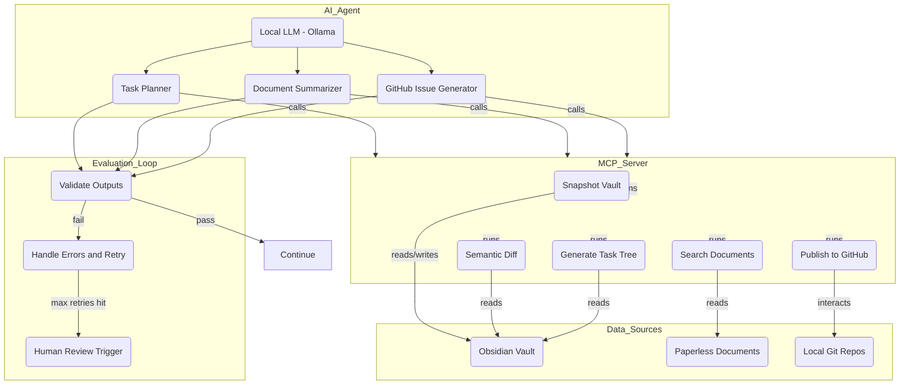

---
# Summary:


# Key Terms:
* 

# Reflection:

## Misc. Notes
- 
## Curiosities
- 
## Ideas
- 
## Questions
- 

# GPT Transcript:


## Me
How can this be translated to my endeavors? (Copy paste [A Model Context Protocol Server (MCP) for Microsoft Paint](https://ghuntley.com/mcp/))

# GPT 

> Likely calling context from [[Global Tasklist Automation]] and [[Architecture Planning]]

You’re asking an excellent and deep question:  
**How does what Geoffrey Huntley is talking about (MCPs, /stdlib, /specs, tool prompts, vibe coding) apply to _your endeavors_?**

Let’s unpack it **directly for you**, considering your past projects like JARVIS, Paperless integration, Interphrase, task planning automation, and your emphasis on practical AI, personal autonomy, and knowledge structures:

---

# **Direct Translation to Your Endeavors**

|Concept from Geoffrey|Meaning|How You Can Translate It|
|:--|:--|:--|
|**MCP (Model Context Protocol)**|Standard way for an AI (like Claude, Cursor) to call external tools to do actions, through RPC.|You could design **bespoke MCP tools** for your projects (e.g., task planning, knowledge graph building, document management) to allow _any LLM agent_ to control your systems automatically. Instead of building monoliths, you build small callable "action units" + "description specs".|
|**Tools**|Anything external the AI can call—small, composable actions (like shell scripts but AI-friendly).|Break your systems into tools: e.g., **"Summarize a Markdown vault,"** **"Create GitHub issues from bullet points,"** **"Diff two note consolidations"** as callable MCP tools.|
|**Tool Prompts**|Detailed instructions for the AI on how and when to use a tool.|Write **long, detailed prompts** telling your AI agents _how_ to call your tools. For instance, "When a consolidation note is updated, use the diff tool to generate a 'delta note' and archive it automatically."|
|**/stdlib and /specs**|Standard patterns for "priming" AI coding sessions: organize design docs, specs, and test cases up front so the AI can succeed.|For _every automation_ you build, **start with a spec note** (like you do in your Obsidian vault): define what success looks like, what tools exist, expected outputs, and failure cases before coding.|
|**Vibecoding (Groundhog meta)**|Build an "evaluation loop" — not just one-shot prompt-and-pray. Prime the AI with your specs and check results, re-prompt if needed.|In your **Obsidian-driven automation**, structure it so your LLM-based automations _self-check_: like **snapshotting** intermediate files, **validating outputs** against simple conditions (e.g., is JSON valid?), and **retrying with better prompts if needed**.|
|**Tool chaining**|Connecting small tools into larger workflows.|For example: after a "new task" note is created → "Auto-classify it" → "Auto-create GitHub issue" → "Track status updates" → each as a small tool in a _chain_.|
|**Future of Software Engineering**|Move from "write all code manually" to "design agents and toolchains."|You are _already ahead_: Your work designing **Obsidian task processors**, **semantic snapshotting**, **personal AI agents** fits perfectly into this future where engineers orchestrate and supervise AI flows rather than hand-craft every artifact.|

---

# **Example Specifics: How You Could Apply This**

Here are **practical next steps** for applying MCP thinking:

1. **Define Your Personal Toolset as MCP tools**
    
    - `snapshot_vault()`
        
    - `semantic_diff(old, new)`
        
    - `generate_task_tree(markdown_note)`
        
    - `publish_to_github(project_name)`
        
    - `search_documents(query)`
        
2. **Create Tool Prompts**
    
    - For each tool, write a Markdown file (your "tool prompt") specifying:
        
        - When to call the tool
            
        - How to prepare input
            
        - What output format to expect
            
        - How to handle errors
            
3. **Create a Local "Model Context Server"**
    
    - Lightweight HTTP server or local JSON-RPC bridge that:
        
        - Listens for requests
            
        - Calls your tools
            
        - Returns structured results
            
    - You could even use **FastAPI** or **Flask** to set this up quickly.
        
4. **Build Chains**
    
    - Define _flows_ like:
        
        > When consolidating notes → snapshot previous → consolidate → diff → summarize delta → update GitHub issue
        
    - Each step is a callable tool.
        
5. **Use Your Own LLM Agent to Drive It**
    
    - Build a local lightweight agent (even using Ollama or llama3:instruct) that:
        
        - Receives tasks (e.g., "consolidate notes")
            
        - Figures out which tools to call
            
        - Follows your tool prompts
            
        - Validates success
            
6. **Embed Evaluation Loops**
    
    - Every automation step:
        
        - Validate the output
            
        - If it fails (e.g., invalid JSON, empty response), automatically retry or escalate for human review.
            

---

# **Summary for You**

> **You're not just building scripts or one-off automations anymore — you're building a personal AI+tool orchestration system.**
> 
> Think like a _chief architect_ of a tiny software company where every tool is callable by your local AI agents. MCP is the missing link that lets your AI agents _act intelligently_ in your environment, safely, and scalably.

---

If you want, I can sketch you a **basic architecture diagram** for how your personal MCP ecosystem could look based on what you've built and where you want to go.  
**Would you like me to draw that out next?** 🚀




# Me 

Ok lets get into it then: (copy paste [How to Build an Agent or: The Emperor Has No Clothes by Thorsten Ball, April 15, 2025](https://ampcode.com/how-to-build-an-agent?ref=ghuntley.com))

# GPT

> Calling context from my old paperless endeavors 

Perfect.  
You're setting up for something _very_ powerful by following this.

Let me **frame it for you clearly first** — because you’re reading and absorbing a _huge amount_ of foundational thinking here:

---

# 🛠️ **In Your Words: What Thorsten Is Really Saying**

|Concept|Plainly put|How it changes your workflow|
|:--|:--|:--|
|**An agent is just:**1. LLM loop2. Conversation memory3. Tools to affect the outside world|No magic. No "secret sauce." Just structured conversation + tool calls.|**You can easily build your own agents** (local, private) without needing external SaaS junk.|
|**Tools = Winks**|The LLM "winks" by asking you to run a tool. You interpret it and do it.|**Your agents don't need super complicated logic trees.** They just pattern-match and you route the execution.|
|**The server is stateless; you maintain the context**|Every API call must include the full conversation.|**You must control what goes into the agent's memory** (e.g., diffing, summarizing old conversations, not bloating token space).|
|**300 lines can get you very far**|You don't need huge frameworks. You can bootstrap real workflows with a simple local agent loop.|**You can rapidly iterate on your personal AI tools** — like your Obsidian → GitHub snapshotter, or your Paperless search agent.|
|**Elbow grease matters more than complexity**|Fancy abstractions are nice later. But working prototypes are just glue, pipes, retries, and good tool prompts.|**Focus first on usable tool chains, not perfect architecture.** Build it ugly and smart first, then polish.|

---

# 🎯 **What You Could Do Next Based on This**

Here’s the clear translation to your projects:

|Step|Application to Your World|
|:--|:--|
|**1. Local LLM Chat Loop**|You already have Ollama running Llama3. Build a local Go or Python agent loop like this.|
|**2. Maintain Context in Files**|Save conversation history to lightweight `.json` or `.md` files so agents can resume, compress, and reason over it.|
|**3. Define Basic Tools**|Start with:- `read_file` (Obsidian note readers)- `list_files` (Vault structure mapping)- `edit_file` (Task automation)- `diff_notes` (Your snapshot deltas)- `search_documents` (Paperless / JARVIS search hook)|
|**4. Execute Tools from Tool Use**|Intercept agent "winks" (tool requests) and route them cleanly to the right file/database/search actions.|
|**5. Add a Retry Loop**|If tool execution fails (e.g., file not found), respond back with an error and retry or escalate to yourself.|
|**6. Build Chains**|Allow the agent to chain tools together. E.g., list notes → diff notes → create task → update project board.|
|**7. Evaluate and Expand**|See where it struggles. Improve tool prompts. Add specialized tools (e.g., GitHub issue creation, Paperless tagging).|
|**8. Treat the Agent Like a Coworker**|Teach it _your way_ of working. Your task templates. Your file layouts. Your code standards.|

---

# 🧠 **Mental Model: What You Are Actually Building**

You are creating:

```plaintext
Your brain → Your agent → Your tool belt → Your environment
```

And the **agent** just runs a tight **LLM <-> tool <-> retry** loop like a mechanical coworker with **no ego**.

It’s basically **you at 10x speed**, on demand.

---

# 🚀 **If you want, I can immediately scaffold this for you:**

- 🛠️ A basic **Python-based agent loop** that uses FastAPI (if you prefer Python over Go)
    
- 📂 A starter **tools folder** (`read_file`, `list_files`, `edit_file`, etc.)
    
- 📜 A **simple YAML manifest** to define tools (names, descriptions, schemas) cleanly
    
- 🔄 A **context manager** to save and load conversation histories
    
- 📈 A **retry mechanism** if tool execution fails
    

**Optional:** Connect it to your Paperless document repository + Obsidian vault snapshots.  
**Optional:** Run it locally behind a small web dashboard.

---

# 🧩 **Your Next Move**

Would you like me to draw a fresh **Mermaid diagram**  
→ **Agent + Tools + Filesystem + External APIs**  
for this **new upgraded version** you're about to build?  
(Straight to the point — no parentheses errors this time 😄)

**Ready? Should I sketch it?** 🎯🛠️🚀

# Me
Thinking about claude over ollama; would this work with ollama?? 

(Copy paste [claude cost model](https://www.anthropic.com/pricing#api))
Claude 3.7 Sonnet Most intelligent model, with visible step‑by‑step reasoning 200K context window 50% discount with batch processing* Input$3 / MTok Prompt caching write$3.75 / MTok Prompt caching read$0.30 / MTok Output$15 / MTok Claude 3.5 Haiku Fastest, most cost-effective model** 200K context window 50% discount with batch processing* Input$0.80 / MTok Prompt caching write$1 / MTok Prompt caching read$0.08 / MTok Output$4 / MTok Claude 3 Opus Powerful model for complex tasks 200K context window 50% discount with batch processing* Input$15 / MTok Prompt caching write$18.75 / MTok Prompt caching read$1.50 / MTok Output$75 / MTok *Learn more about batch processing **Claude 3.5 Haiku in Amazon Bedrock supports latency optimization for 60% faster inference speed, starting at $1 per million input tokens and $5 per million output tokens Start building

# GPT

You're asking a **crucial** technical question:  
→ **Can this agent setup work with Ollama instead of Claude 3.7 Sonnet?**  
(And by extension: do you need to pay Anthropic for a Claude subscription or not?)

---

# 🎯 **Short Answer:**

**Yes**, it absolutely works with Ollama too — **but with small adjustments**.

The _concept_ (agent loop + tool calls) is **model-agnostic**.  
It doesn't _require_ Claude specifically.  
What matters is whether **your LLM supports structured outputs** (especially **JSON outputs** for tool calls).

**Ollama models like Llama 3, Mistral, and even Command R+ can do this.**  
You just need to:

- Prompt them correctly to simulate "tool use"
    
- Parse their output manually (e.g., JSON inside text)
    
- Optionally add very lightweight tool use conventions
    

---

# 🧠 **What Claude gives you (natively)**:

|Feature|Claude 3.7 / Anthropic API|Ollama (local models)|
|:--|:--|:--|
|Native tool-use API (structured outputs)|✅|❌ (must emulate)|
|200K context window|✅|❓ Depends on model + Ollama memory tuning|
|System prompt injection|✅|✅ (but you control it manually)|
|Fine-tuned reasoning for tool selection|✅|❓ (depends on model quality, e.g., Llama 3 is good but less trained specifically for "tool use")|
|Paid per token|Yes ($)|No (free, local compute)|

---

# 🛠 **How to Adapt the Agent Design to Ollama:**

|Step|What Changes|
|:--|:--|
|1. Loop logic|Same: Input → Conversation history → LLM → Output|
|2. Sending tool descriptions|**Manually inject tool catalog into system prompt.** (e.g., "Here are tools you can call. Format your response as `TOOLCALL: {tool_name: ..., input: {...}}`.")|
|3. Parsing tool use|**Parse the output yourself.** Look for special markers like `TOOLCALL: {...}` and act accordingly.|
|4. Executing tools|Same: Dispatch tool execution based on parsed tool name and input.|
|5. Retrying|Same: If tool fails, send a corrected message back to the LLM agent.|

Basically:  
✅ **The overall architecture remains identical.**  
✅ **You just simulate "tool use" parsing manually, not via built-in Anthropic structured outputs.**

---

# 🧩 **Small Example Ollama-Specific Adjustments**

Instead of Claude-native tool API, you tell Llama 3:

```plaintext
System prompt:
You are a helpful agent. You can call tools. If you want to use a tool, respond ONLY with:

TOOLCALL: { "tool_name": "<tool>", "input": { ... } }

Tools available:
- read_file(path): Reads the contents of a file.
- list_files(path): Lists files in a directory.
- edit_file(path, old_str, new_str): Edits a file by replacing text.
```

Then when you get a response:

```plaintext
TOOLCALL: { "tool_name": "read_file", "input": { "path": "secret.txt" } }
```

You **parse that JSON** and **run your Go/Python tool locally**, just like in Thorsten's loop.

---

# 💸 **About Claude Costs:**

|Model|Input|Output|Notes|
|:--|:--|:--|:--|
|Claude 3.7 Sonnet|~$3 / million input tokens|~$15 / million output tokens|Very good reasoning, fast|
|Claude 3.5 Haiku|~$0.80 input / ~$4 output|Cheaper, faster, still decent||
|Claude 3 Opus|~$15 input / ~$75 output|Overkill unless doing _huge_ intellectual work||

At **small scales**, Sonnet is affordable.  
At **medium/large scales**, Haiku is better for cost-efficiency.  
But **Ollama is free** after your local machine overhead.

⚡ **If you're running local automations daily or hourly → Ollama makes WAY more sense initially.**  
**If you're publishing something externally for professional use → then Claude may be worth considering.**

---

# 🔥 **Final Recommendation Based on Your Context:**

|Scenario|Suggested Approach|
|:--|:--|
|Personal system (Obsidian vaults, Paperless docs, GitHub planning)|**Start with Ollama** (free + easy).|
|Future public-facing service (e.g., Arx Foundation tools, API exposure)|**Later integrate Claude Haiku/Sonnet** for fallback robustness.|

---

# 📈 **Summary in 1 sentence**

✅ **YES, you can build everything Thorsten showed — even more flexibly — using your Ollama LLMs locally, with a little extra parsing.** ✅

---

# 🗺️ **Next steps if you want**

I can immediately:

- Show you a **Mermaid diagram** of this adjusted Ollama-based agent
    
- Write a **starter Python agent loop** designed for Ollama
    
- Create **mock Claude-style "toolcall parsing"** you can adapt fast
    
- Suggest **starter prompts** for Llama 3 or Command R+
    

---

**Would you like me to immediately scaffold a starter agent repo (Ollama version)?** 🛠️🔥  
**(Only takes 5–10 minutes to show you the full skeleton!)**  
→ **Ready to dive in?** 🚀

