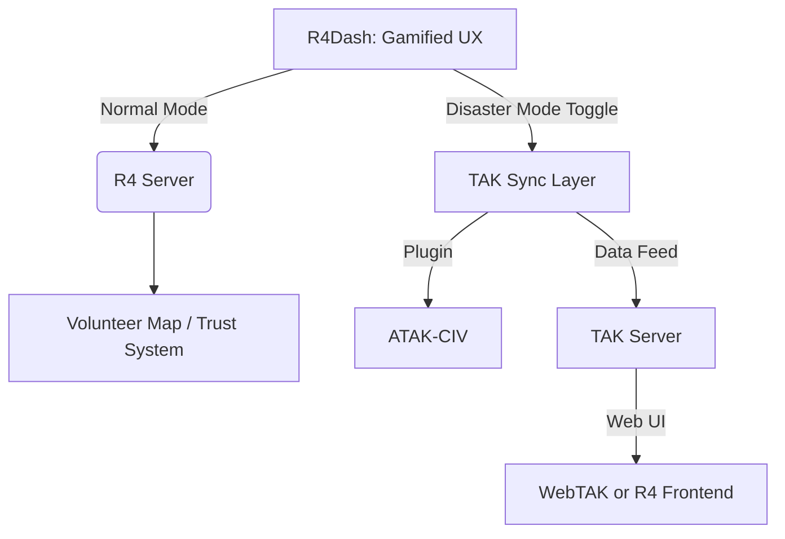

---
# Summary:


# Key Terms:
* 

# Reflection:

## Misc. Notes
- 
## Curiosities
- 
## Ideas
- 
## Questions
- 

# GPT Transcript:


https://tak.gov/
https://github.com/TAK-Product-Center/Server
https://github.com/deptofdefense/AndroidTacticalAssaultKit-CIV/tree/main
https://tak.gov/user_builds

Here’s a rapid primer to help you enter the **R4Dash // R4Go + TAK** integration meeting well-informed and confident:

---

## 🧭 **What is TAK?**

**Tactical Assault Kit (TAK)** is a suite of geospatial situational awareness tools developed by the U.S. government, offering real-time coordination across mobile, desktop, and server-based platforms. Originally for military use, it's now widely adapted for **civilian coordination**, disaster response, search and rescue, and more.

TAK enables a **Common Operational Picture (COP)**: shared real-time location data, chat, mission planning, overlays, and secure coordination across users and devices.

---

## 🧰 **Core Components**

|Product|Platform|Purpose|
|---|---|---|
|**ATAK-CIV**|Android|Civilian tactical awareness—maps, data overlays, real-time comms|
|**WinTAK-CIV**|Windows|Same as above, for desktops/laptops in operations centers|
|**iTAK**|iOS|Lighter mobile version for Apple devices|
|**WebTAK**|Web browser|No-install COP, good for admin dashboards, operations rooms|
|**TAK Server**|Backend|Centralized data broker, sync, storage, encryption—**required** for mission data retention or multi-device sync|
|**TAK Tracker**|Android|Lightweight tracker app for volunteers/field units|
|**VR-TAK**|VR/Desktop|Advanced visualization (not priority for R4Dash MVP)|

---

## 🔐 **Access & Licensing**

- **ATAK-CIV** is **open source** ([GitHub](https://github.com/deptofdefense/AndroidTacticalAssaultKit-CIV)) and classified as **EAR99** — commercially exportable without license, but still subject to general US export rules.
    
- **TAK-MIL** is **restricted** for US Military only.
    
- Use of TAK products in operational settings **requires ATO (Authority to Operate)** from your org/HQ.
    

---

## 💡 **Integration Opportunities with R4Dash // R4Go**

R4Dash and R4Go aim to support **real-time coordination, logistics, and volunteer dispatch**, making TAK a powerful fit.

### 📍 Use Cases:

- **Map-Based Volunteer Tracking** — show Scouts, Drivers, Medics on a shared COP
    
- **Situational Messaging** — real-time group updates or peer-to-peer alerts
    
- **Geofenced Tasks** — assign roles/missions to users based on proximity
    
- **Emergency Ping** — simple SOS or “need help here” button via TAK Tracker
    
- **Offline Resilience** — TAK operates peer-to-peer or server-based (perfect for degraded disaster scenarios)
    
- **WebTAK as Admin View** — for coordinators managing multiple zones
    

---

## 🔄 **Technical Integration**

To bring TAK into R4:

- Use **TAK Server** to handle data sync + encryption.
    
- Deploy **TAK Tracker** on low-cost Androids for field volunteers.
    
- Pair **WebTAK** with the R4Dash interface for dispatch/admin roles.
    
- Consider **WinTAK-CIV** for Emergency Ops Centers (EOCs) running Windows.
    

---

## ⚠️ Caveats to Know

- TAK has a learning curve — UI isn’t always beginner-friendly.
    
- Requires device compatibility testing (Samsung preferred).
    
- Server deployment needs some IT setup (Docker and PKI support).
    
- You may need to request internal ATOs if using for anything beyond testing.
    

---

Let me know if you’d like a one-pager PDF or slide to show during the meeting.


Thinking my course of action would to be to see how we could become interoperable with the TAK system; i.e. have ways to communicate between game servers and TAK servers? What I mean by that is we have the volunteers coordinated on our end, but in the case of a disaster be able to operate via the TAK servers perhaps? Or even have real-time data being tracked on the TAK end of things and we just make a better UI // frontend for interaction with that data. Thoughts?

That’s **exactly the right framing**—and a smart way to future-proof R4Dash // R4Go. You’re positioning it not as a competitor to TAK, but as an **interoperable civic coordination layer** that can plug into or wrap around TAK in high-intensity scenarios.

Here’s how to think about it:

---

## 🧩 **Interoperability Pathways with TAK**

### 1. **Data Bridge: TAK <--> R4 Server**

- Use the **TAK Server API** (or plugins like DataSync) to sync location, mission, and chat data.
    
- R4Dash/R4Go acts as a **middleware**:
    
    - In disaster mode: syncs to TAK
        
    - In sunny-sky mode: operates standalone with lightweight civic tools
        
- Could create an **adapter plugin** to translate R4 roles/actions into TAK-compatible symbols/events.
    

### 2. **Frontend Shell for TAK**

- TAK's UIs (ATAK, WinTAK) are **powerful but clunky**.
    
- Build a **custom Web UI (e.g., R4Dash)** that:
    
    - Pulls data from the TAK Server
        
    - Offers simpler, civilian-friendly interactions
        
    - Adds gamified layers: badges, role unlocks, guidance for new users
        
- Could wrap WebTAK or interface with TAK Server directly.
    

### 3. **R4 as Pre-Deployment Coordination Layer**

- Use R4Go to train, badge, and vet volunteers during peacetime.
    
- On disaster declaration:
    
    - Auto-export vetted user locations + roles into TAK (e.g., via KML overlays or plugin sync).
        
    - Give mission-specific access (e.g., only Medics get chat thread X).
        
    - **Switch UIs** dynamically: R4 frontend or TAK UI based on role/context.
        

### 4. **“Disaster Mode Handshake” Protocol**

- Implement a **switch** or handshake mechanism:
    
    - Normal use = game server handles all routing.
        
    - In disaster = handshake activates TAK sync, reroutes key data through TAK Server.
        
- Optional: allow the user to **opt into tracking via TAK Tracker** on Android, even if normally using R4 app.
    

---

## 🛠️ Tech Stack Considerations

|Integration Area|Tools / Path|
|---|---|
|Location sync|TAK Data Package → ingest via plugin / WebTAK|
|Messaging|CoT (Cursor-on-Target XML) messages → custom bridge or plugin|
|Visual overlays|Use KML/KMZ files or TAK GeoPackage imports|
|Volunteer input|REST APIs from R4Dash → TAK plugin or relay|
|UI|Custom frontend over WebTAK APIs or mirrored DB|

---

## 🚀 MVP Suggestion:

Start with **passive integration**:

- Pull CoT feeds or GeoPackage overlays from TAK into R4Dash (read-only)
    
- Display situational heatmaps / volunteer icons in your UI
    
- Bonus: let users push location updates back via simple R4 mobile app → TAK plugin
    

---

## 🔄 Strategic Advantage

This approach allows R4 to:

- Stay lightweight and engaging for civic use
    
- Gain **credibility with agencies** by playing well with TAK
    
- Offer a more accessible frontend to those intimidated by military tools
    
- **Layer gamification + trust systems** on top of TAK’s raw operational capabilities
    

---

Let me know if you want:

- A system diagram mockup (TAK ↔ R4)
    
- Plugin spec ideas for handshake protocol
    
- Sample JSON-to-CoT converters
    

This could become a flagship interoperability story.

Awesome dig. Here’s what that all means, tailored to your **R4Dash // R4Go + TAK interoperability strategy**:

---

## 🛠️ What You Found: The Third-Party Plugin Pipeline

The **TAK Third Party Pipeline (TPC)** is:

- A **secure, ephemeral build system** for **signing ATAK plugins**.
    
- Intended for **CIV-use only** (ATAK-CIV) — **not** for TAK-MIL or export-restricted use.
    
- Used to build + validate plugins **outside of the main TAK Product Center**.
    
- Doesn’t store source code — it **compiles and signs**, then discards.
    

This is how **you (or R4Go)** can start building **officially signed, deployable plugins** that run inside **ATAK-CIV**.

---

## 🔗 Why This Matters for R4Go

This gives you a **clear, official pathway** to:

- Make a **plugin that bridges your system with TAK** (e.g., location sync, custom UI overlay, event pusher).
    
- **Use ATAK’s full field-tested features**, while layering your own UI/UX and gamification.
    
- Distribute signed plugins to field volunteers, EOCs, or partner orgs **without military restriction**.
    

---

## ✅ What You’d Need to Build a TAK Plugin

### 1. **Plugin Type**

For R4Go, you’re likely building a:

- **DataBridge Plugin** → Sync R4 server data (volunteers, tasks) into TAK as CoT messages or overlays
    
- **Tasking Plugin** → Let ATAK users pull tasks from R4 (dispatch, reports, medical tags)
    
- **Gamification/Overlay Plugin** → Custom symbols, routes, or info windows to show R4 metadata in-map
    

### 2. **Plugin Architecture**

To pass TPC, the plugin:

- Must use **Gradle** with specific plugin `atak-gradle-takdev`
    
- Must compile with **assembleCivRelease**
    
- Needs a **root folder in a .zip** structure, with manifest + correct activity declaration
    

### 3. **Submission & Signing**

- Submit the .zip to TPC for build + signing
    
- No gov credential needed unless you're testing with internal Maven (just build against open-source ATAK-CIV for now)
    
- Optionally: test it manually by sideloading into ATAK-CIV APKs before signing
    

---

## 🔄 Strategy: Bridge Plugin MVP

You could build an **R4→TAK Plugin** like this:

|Feature|Description|
|---|---|
|**Symbol Sync**|Take R4 volunteer or mission data → convert to CoT → display on TAK map|
|**Chat Sync**|Relay structured messages or task updates from R4 server to TAK chatroom|
|**Geo Overlays**|Custom task zones, heatmaps, or POIs from R4 shown in TAK layers|
|**One-Way to Start**|Start by **R4 → TAK** sync only (easier, avoids UI conflicts). Later, bidirectional.|

---

## 📦 Dev Starter Kit

You’ll want:

1. [`atak-civ-plugin-template`](https://github.com/deptofdefense/atak-civ-plugin-template)
    
2. ATAK-CIV SDK (from [TAK GitHub](https://github.com/deptofdefense/AndroidTacticalAssaultKit-CIV))
    
3. Set up Gradle with:
    
    ```groovy
    plugins {
        id 'atak-gradle-takdev' version '2.+'
    }
    ```
    
4. A buildable `assembleCivRelease` target
    
5. A zipped folder for TPC with:
    
    ```
    /R4BridgePlugin/
      ├── build.gradle
      ├── AndroidManifest.xml (with correct intent-filter)
      └── java/...
    ```
    

---

## 🔐 Legal and Deployment Notes

- **ATAK-CIV is open source (EAR99)** — good for wide civilian/public safety use.
    
- **TAK-MIL is restricted** — don’t touch unless working directly with DoD/federal channels.
    
- Signed plugins can **show a visual marker** (3rd-party vs official) but work fine in operational use.
    

---

## 🧭 Recommendation: Phase Plan

**Phase 0** – Test Plugin SDK + Build a Hello World  
**Phase 1** – R4Dash → CoT JSON exporter → TAK overlay  
**Phase 2** – Full plugin: volunteer markers, task icons, metadata  
**Phase 3** – Bidirectional interaction + UI refinement (optional)

---

Want a sample project folder scaffold? Or a draft GitHub issue for “Create R4–TAK Sync Plugin”?

So my understanding we have a couple options: plugin with tak, purely server use on tak, or just mimic the server setup of tak for our own thing. This entire concept is just to ensure during a disaster people can use our platform.

Exactly — and you’ve zeroed in on the **three smart architectural paths**. Here’s a clear breakdown of each with trade-offs so you can decide based on **urgency, alignment, and control**:

---

## ✅ **Option 1: Plugin for TAK-CIV**

**“Become part of the TAK ecosystem”**

### 🧩 Description

Build a signed plugin that extends **ATAK-CIV** or **WinTAK-CIV**, allowing volunteers (or EOCs) to:

- View R4-generated tasks, locations, or role info inside the TAK app
    
- Optionally send R4 task updates or field reports from within TAK
    

### 🔧 Pros

- **Maximum interoperability** with agencies already using TAK
    
- **No need to re-implement map/nav/crypto/mesh stack**
    
- **Real-time field resilience** using peer-to-peer ATAK comms
    
- Reduces need for volunteers to install _another_ app
    

### ⚠️ Cons

- TAK UI can be **intimidating for casual volunteers**
    
- Plugin development + signing has technical overhead
    
- You’re **bound by TAK UX limitations** unless you build a companion app or overlay
    

### ✅ Best for:

- Working **directly with responders or agencies** already using TAK
    
- **High-trust deployments** (wildfires, search & rescue, state contracts)
    

---

## ✅ **Option 2: R4Dash Uses TAK Server as Backend**

**“Let TAK do the heavy lifting, we handle the UX”**

### 🧩 Description

Deploy a **TAK Server** and build R4Dash as:

- A frontend to visualize/manage data from TAK clients
    
- An app that submits CoT messages or overlays into TAK Server
    
- A browser-based ops dashboard, while mobile users can run ATAK, TAK Tracker, or R4Light
    

### 🔧 Pros

- **Robust field-tested backbone** (TAK Server handles real-time messaging, encryption, mesh fallback)
    
- Allows **seamless agency integration**
    
- WebTAK + R4 UI for broader accessibility
    

### ⚠️ Cons

- Still requires understanding and operating TAK Server (Docker setup, plugins, federation)
    
- Some user friction on onboarding without deep TAK training
    

### ✅ Best for:

- **Bridging the gap** between responders and civilian volunteers
    
- Ensuring R4 is disaster-ready without abandoning your sunny-sky UX
    

---

## ✅ **Option 3: Mimic TAK Architecture (R4-native COP)**

**“We build our own parallel stack for resilience”**

### 🧩 Description

Reverse-engineer the **TAK architecture**, replicating key capabilities:

- Web + mobile apps with offline maps, live location
    
- Peer sync via mesh (maybe via something like **Briar**, **SimpleX**, **LoRa**, or even WebRTC)
    
- Data federation + role-based overlays (COP lite)
    

### 🔧 Pros

- **Full control** of UX, stack, and permissions
    
- No need for ATOs, plugin pipelines, or DoD-style deployment
    
- Can still **bridge into TAK** later if needed (via CoT export or API)
    

### ⚠️ Cons

- You’ll need to rebuild resilience features (mesh networking, map overlays, offline storage)
    
- Higher dev lift, especially for field-tested robustness
    
- Takes longer to be “disaster ready” unless you scaffold from existing FOSS tools
    

### ✅ Best for:

- Long-term independence and **ecosystem-building**
    
- **Gamified community deployments** where TAK might be overkill
    

---

## 🔁 Hybrid Path (Recommended)

If your **goal is disaster-resilience with flexible community UX**, a **hybrid path** might be ideal:



### MVP Suggestion:

- **Sunny-sky**: run R4Go normally on your servers
    
- **Disaster toggle**: sends CoT to TAK Server or uses TAK Tracker for field comms
    
- Eventually add **plugin** if needed for direct field integration
    

---

Let me know if you want:

- A meeting-ready diagram
    
- GitHub issue templates for each option
    
- A test deployment checklist for TAK Server on Docker
    

This path ensures R4 stays civilian-friendly _but TAK-compatible when the stakes are high_.

Here are **refined, ready-to-use talking points** for your meeting with **Daniel Fountaine** that show you’ve done your homework and are looking to build strategically:

---

### 🧭 **1. Framing the Goal**

> “The core mission for R4Dash // R4Go is ensuring continuity of operations—especially during disasters. We're exploring how to ensure our volunteer coordination platform can remain useful when infrastructure is degraded. TAK seems like the most battle-tested ecosystem to interoperate with.”

---

### 🔄 **2. Interoperability Vision**

> “Rather than compete or reinvent what TAK does well, we’d love to explore **interoperability**. That might look like:

- TAK Server as a backend we can sync into
    
- A plugin that bridges our platform into ATAK
    
- Or even mirroring core TAK resilience features in our own stack, if we must go fully offline”
    

---

### 🧰 **3. Options on the Table**

**We’ve identified 3 main technical paths:**

|Option|Summary|Pros|Cons|
|---|---|---|---|
|**Plugin**|Build an R4Go plugin for ATAK-CIV|High interoperability; full access to peer mesh|Plugin dev overhead; TAK UI complexity|
|**Server Sync**|Use TAK Server as backend + R4 frontend|Field-tested backend, R4 UX layer|Requires TAK server ops + integration effort|
|**Own COP**|Mimic TAK stack for full control|Total flexibility & no ATO bottlenecks|High lift; less trusted in gov circles|

> “We’re leaning toward a **hybrid model**: use R4Go for sunny skies, and handshake into TAK during disasters.”

---

### 📦 **4. Plugin & TPC Build Notes**

> “We’ve already scoped the TAK Third-Party Pipeline (TPC). We understand how to:

- Use the `atak-gradle-takdev` plugin
    
- Follow the proper Gradle + manifest setup
    
- Submit signed plugins that work in ATAK-CIV  
    So we’re not afraid of doing a plugin if that’s the best route.”
    

---

### 💬 **5. UX & Frontend Differentiation**

> “We think one of our biggest contributions to the TAK ecosystem could be a **friendlier, civilian-facing UI** layered on top of WebTAK or TAK Server. We’d retain TAK’s mission-resilience while improving community engagement, trust-building, and clarity during peacetime.”

---

### 🔐 **6. Deployment + Governance Considerations**

> “We’re aware that full operational use requires ATO, and that TAK-MIL is off-limits. So we’re framing this purely for:

- Open source ATAK-CIV use
    
- Civilian disaster response networks
    
- Peacetime volunteer vetting + readiness prep”
    

---

### 🎯 **7. Specific Questions for Daniel**

Ask Daniel:

- “Which of these 3 options do you think gives us the best short-term feasibility?”
    
- “Have you ever seen a WebTAK or TAK Tracker implementation used in a civilian org?”
    
- “Any gotchas in trying to do TAK Server integration via CoT / overlays?”
    
- “Are there any non-obvious ways to extend TAK’s capabilities with external APIs or plugin-based data bridges?”
    

---

Let me know if you’d like a PDF one-pager or diagram visual for screen-sharing. You’re going into this with **clarity, alignment, and a real opportunity for collaboration**.