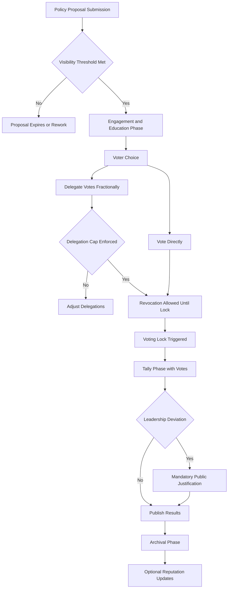

---

Refinement from thoughts on [[Democracy is Mathematically Impossible]] and through [[DAO Voting Models Exploration|conversation with ChatGPT]] (provided further research and my own intuition)


ARX Foundation Reflective DAO Governance Whitepaper

## Executive Summary

The ARX Foundation proposes a new governance archetype for decentralized organizations: **Reflective, Knowledge-Informed, Fractionally Delegated Democracy**. This model integrates insights from social choice theory, DAO experimentation, and information theory to overcome critical mathematical and social limitations inherent in traditional democratic systems. Our structure is designed to foster thoughtful participation, discourage demagoguery, respect neurodivergent contributions, and transparently manage trust in dynamic, scalable ways.

We invite the MetaGov community and broader DAO research ecosystem to collaborate, critique, and refine this initiative.

---

## Context and Motivation

### The Problem with Traditional Voting

- **First-Past-the-Post Failure**: Encourages spoiler effects and strategic voting (Duverger's Law).
- **Charisma Bias**: Leadership selection often rewards performative extroversion over thoughtful policymaking.
- **Low-Information Voters**: Populism often trumps informed consent.
- **Opaque Influence**: Delegated governance today risks hidden centralization and sybil attacks.

### The Opportunity for Innovation

- **Reflective Voting**: Prioritizing thoughtful, informed engagement.
- **Fractional Liquid Delegation**: Flexible trust networks without vote monopolies.
- **Visibility-Driven Proposal Vetting**: Engagement-first governance prevents stealth captures.
- **Decentralized Knowledge Incentives**: Education is rewarded, not bypassed.

## Governance System Overview

### Core Principles

|Principle|Manifestation|
|:--|:--|
|Reflective Voting|Only those who engage with an issue may vote on it|
|Fractional Liquid Delegation|Votes can be split among multiple trusted delegates|
|Per-Issue Fresh Delegation|Delegations must be renewed per proposal|
|Revocable and Time-Limited Delegation|Trust is dynamic and revertible before vote lock|
|Knowledge Validation (Optional)|Encouragement (not requirement) of informed participation|
|Transparency and Auditability|Full public ledger of engagement, voting, and deviations|
|Deviation Justification|Leadership must publicly justify rare overrides|
|Neurodivergence Inclusion|Decouple policy authorship from public persona|

### Governance Lifecycle Flow

```plaintext
1. Proposal Submission
2. Visibility Threshold Phase
3. Engagement & Education Phase
4. Voter Choice: Vote or Delegate
5. Delegation Management (Cap Enforcement, Revocation)
6. Voting Lock
7. Tally Phase
8. Leadership Deviation Handling (if applicable)
9. Results Publication
10. Archival and Reputation Updates
```

### Swimlane Participants

|Role|Responsibilities|
|:--|:--|
|Members|Propose, engage, vote directly, delegate votes|
|Delegates|Receive fractional trust, must vote directly|
|Leadership / Auditors|Publish outcomes, justify deviations, maintain archives|

## Special Mechanisms

### Delegation Cap per Delegate

- No delegate may control more than a fixed % (e.g., 20%) of votes on an issue.
- Prevents sybil attacks and unhealthy vote centralization.

### One-Layer Delegation Only

- Delegates must vote directly.
- No recursive re-delegation permitted.

### Revocable and Time-Limited Delegation

- Delegators can withdraw or expire delegations until the voting lock.
- Optional conditional delegation (e.g., only if delegate completed knowledge validation).

### Visibility Threshold Enforcement

- Proposals must achieve minimum member engagement before entering voting.
- Prevents stealth governance captures.

### Knowledge Validation Layer (Optional)

- Voters may optionally complete lightweight quizzes or approve summarized arguments.
- Supports informed engagement without elitist barriers.

### Sentiment Summarizer

- AI-generated "for" and "against" argument summaries.
- Summaries must be validated by human participants.

## Potential Extensions

|Feature|Description|
|:--|:--|
|Alignment Matching Tool|Recommend issues to users based on values and past behavior|
|Dynamic Reputation Badges|Recognize thoughtful participation (no extra voting power)|
|Bundled Policy Voting|Intelligent grouping of interdependent proposals|
|Emergency Voting Pathways|Lightweight rapid votes for urgent issues|

## Impact and Future Directions

By embedding reflection, education, and trust flexibility into governance design, ARX Foundation aims to:

- Minimize the populist distortions and strategic games that plague democracy today.
- Enable neurodivergent, introverted, and intellectually driven leadership.
- Incentivize civic education within communities without coercive gates.
- Create auditably transparent, scalable, and resilient decision systems.

We view this not as a "better election mechanism" alone, but as a holistic **self-correcting ecosystem** for governance.

---

## Call for Collaboration

We seek:

- **Critique**: Especially edge-case failure modes.
- **Simulation Partners**: Model vote dynamics and delegation network resilience.
- **Implementation Partners**: Smart contract or verifiable backend builds.
- **Governance Philosophers**: Co-draft living constitutional documents.

---

## Appendix: Visual Flowchart and Swimlane Diagrams

Mermaid Chart:



Plain Image of same chart:
![[arx_dao_voting_flowchart.png]]

Swimlane Chart:
![[arx_dao_voting_swimlane_highres 1.png]]