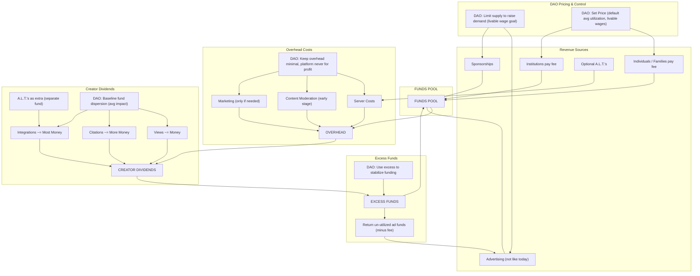

---

```mermaid
flowchart TD
    %% Group 1: Revenue Sources
    subgraph Revenue["Revenue Sources"]
        A16["Individuals / Families pay fee"]
        A17["Institutions pay fee"]
        A1["Advertising (not like today)"]
        A2["Sponsorships"]
        A18["Optional A.L.T.'s"]
    end

    %% Group 2: DAO Pricing Logic
    subgraph Pricing["DAO Pricing & Control"]
        A4["DAO: Limit supply to raise demand (livable wage goal)"]
        A15["DAO: Set Price (default avg utilization, livable wages)"]
    end

    %% Group 3: Central Fund
    subgraph Fund["FUNDS POOL"]
        A3["FUNDS POOL"]
    end

    %% Group 4: Overhead Costs
    subgraph Overhead["Overhead Costs"]
        A5["OVERHEAD"]
        A6["Server Costs"]
        A7["Content Moderation (early stage)"]
        A8["Marketing (only if needed)"]
        A9["DAO: Keep overhead minimal, platform never for profit"]
    end

    %% Group 5: Creator Rewards
    subgraph Creator["Creator Dividends"]
        A10["CREATOR DIVIDENDS"]
        A19["Views ~= Money"]
        A20["Citations ~= More Money"]
        A21["Integrations ~= Most Money"]
        A22["A.L.T.'s as extra (separate fund)"]
        A11["DAO: Baseline fund dispersion (avg impact)"]
    end

    %% Group 6: Excess Funds Management
    subgraph Excess["Excess Funds"]
        A12["EXCESS FUNDS"]
        A13["Return un-utilized ad funds (minus fee)"]
        A14["DAO: Use excess to stabilize funding"]
    end

    %% Linkages (preserving some orientation)
    A16 --> A3
    A17 --> A3
    A1 --- A3
    A2 --- A3
    A18 --> A6

    A4 --> A1
    A4 --> A2
    A15 --> A16
    A15 --> A17

    A3 --> A5
    A5 --> A10
    A6 --> A5
    A7 --> A5
    A8 --> A5
    A9 --> A6
    A9 --> A7
    A9 --> A8

    A10 --> A12
    A19 --> A10
    A20 --> A10
    A21 --> A10
    A22 --> A21

    A11 --> A19
    A11 --> A20
    A11 --> A21

    A12 --> A13
    A14 --> A12

    A12 --> A3
    A13 --> A1

```
