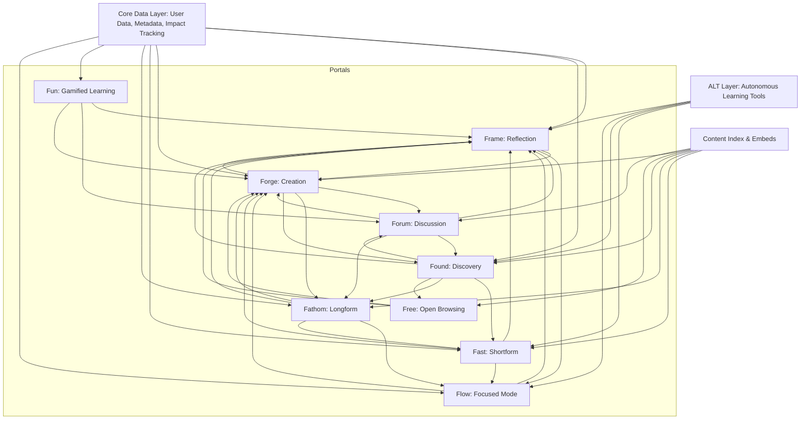
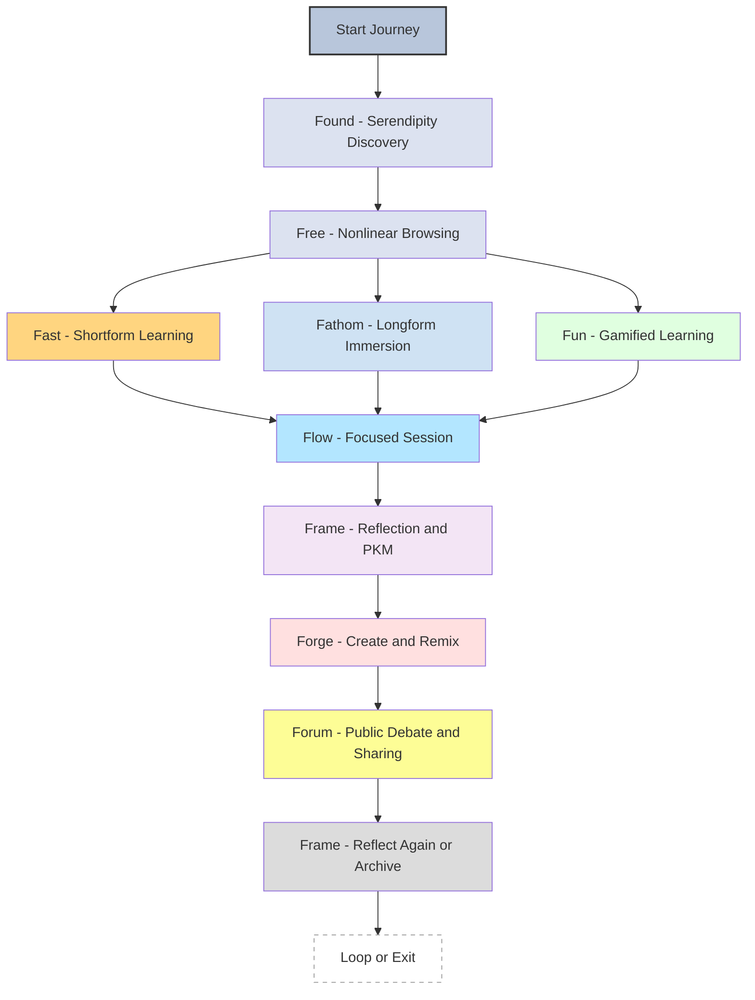
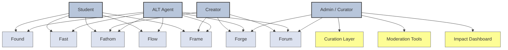
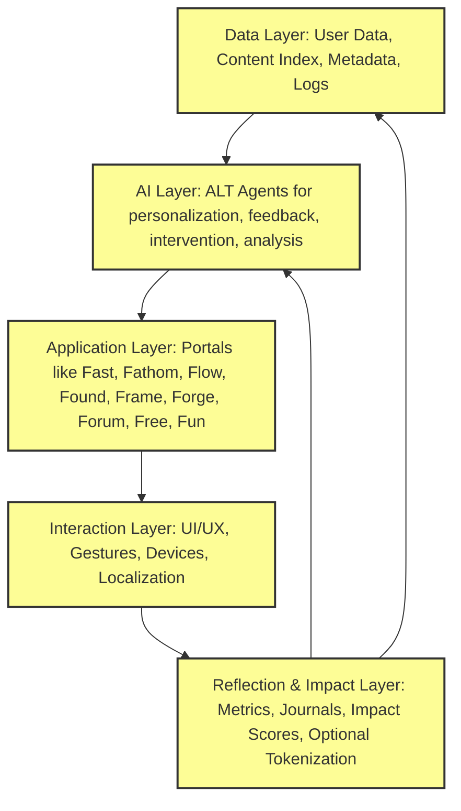
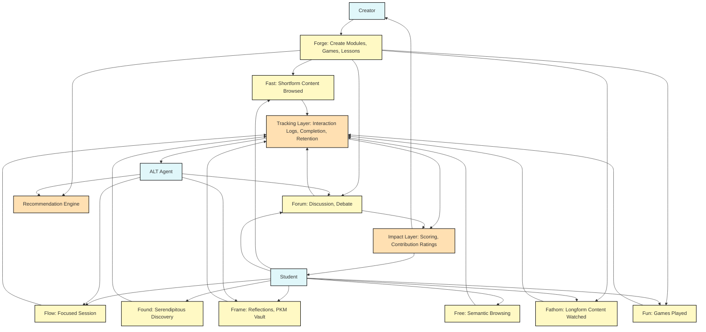

---
(Using GPT for this so take with grain of salt; input [[Fast - Augment Realities eXpedition]], [[Fathom - Augment Realities eXegesis]], [[Flow - Augment Realities eXpergefaction]], [[Forge - Augment Realities eXternalization]], [[Forum - Augment Realities eXpostulations]], [[Found - Augment Realities eXcursion]], [[Frame - Augment Realities eXpurgation]], [[Free - Augment Realities eXploration]], [[Fun - Augment Realities eXtravaganza]], and the raw source code of [[The SCOOL Student Experience.canvas|The SCOOL Student Experience]])

Consolidating these into a single unified system architecture will help clarify how each portal functions, shares infrastructure, and interacts across the ecosystem.

Here’s the **SCOOL Unified Portal System Architecture**, showing:

- **Core Shared Infrastructure**
    
- **Portal-Specific Frontends**
    
- **ALT Layer (Agents)**
    
- **Cross-Portal Interoperability**
    
- **User Data Layer / Frame Integration**
    

---

## 🧠 **SCOOL System Architecture – High-Level View**

---

## 🔧 Shared Subsystems & Specialization Highlights

|Layer|Description|Used Extensively In|
|---|---|---|
|**Core Data Layer**|Stores all user actions, PKM trails, skip logs, reflections, impact data|Frame, Fast, Flow|
|**ALT Layer**|Intelligent agents (e.g., Bliss) that shape experience, regulate dopamine loops, enhance reflection|Flow, Fast, Frame|
|**Content Index & Embeds**|Wraps internet content in SCOOL UX — includes licensing, metadata injection, embed hooks|Fathom, Found, Free, Forge|
|**Game Engine / Daemon**|Runtime environment, device scanner, performance mapping|Fun|
|**Thread Graph Layer**|Meta-discussion engine — links belief friction and cross-platform quotes|Forum, Found|
|**Branch View Engine**|Sacred Timeline UI — mental thread tracing|Free, Flow, Frame|

---

## 🧭 Portal Roles (in one sentence each)

- **Fast**: Bite-sized conceptual delivery with reinforcement tracking
    
- **Fathom**: Deep immersive consumption with sacred focus
    
- **Forum**: Public reasoning and belief dialogue across media
    
- **Fun**: Educational arcade with tracked learning
    
- **Free**: Open, nonlinear exploration and branch mapping
    
- **Flow**: Deep work and focus sessions with intent scaffolding
    
- **Forge**: Creation, remixing, and publishing zone
    
- **Found**: Discovery engine seeded by curiosity, guided by conversation
    
- **Frame**: Central PKM and reflection hub tying everything together
    

---

### 🧭 **User Journey Diagram (e.g. Learn → Reflect → Create)**

Best for understanding **flow and transitions** — how a learner navigates SCOOL over time.

|Stage|Portals Emphasized|Purpose|
|---|---|---|
|**Discover**|Found, Free|Curiosity & entry|
|**Learn**|Fast, Fathom, Fun|Content consumption|
|**Focus**|Flow|Deep dives & cognitive alignment|
|**Reflect**|Frame|Personal growth, journaling|
|**Create**|Forge|Remixing, publishing|
|**Discuss**|Forum|Debate, critique, ideation circulation|

✅ Ideal for visualizing **learning cycles**, **session types**, or the **semantic loop** between input → processing → output.

**User Journey Diagram in Mermaid** format that maps a typical flow through the SCOOL system — from discovery, through learning, into reflection and creation:

### 🔁 Notes:

- **Multiple entry points** are possible (e.g., straight into Found or Free).
    
- All learning modes (Fast, Fathom, Fun) **can lead into Flow** for focused deepening.
    
- **Frame is the memory mirror**, guiding future journeys or creation.
    
- **Forge and Forum** close the loop by letting the user **externalize** or **debate** what they’ve learned.
    

---

### 🧑‍🚀 **Role-Based Architecture (e.g. Student, Creator, ALT, Admin)**

Best for understanding **access layers, permissions**, and **tool affordances** per role.

|Role|Portals Primarily Used|Special Abilities|
|---|---|---|
|**Student**|Found, Fast, Fathom, Flow, Frame|Learning paths, skip history, progress metrics|
|**Creator**|Forge, Frame, Forum, Fathom|Publish, remix, build learning trails, earn impact|
|**ALT**|ALL (invisible layer)|Curate, nudge, reflect, filter, guide|
|**Admin / Curator**|Curation layer, Moderation tools, Impact Dashboard|Manage platform structure, approve content packages|

✅ Ideal for mapping **system architecture**, **data access**, and **interface specialization**.

**Mermaid diagram** showing the **role-based architecture** of SCOOL — mapping how each role interacts with the system’s portals and layers:

Note from Landon on above: Student would have access to all tools, but potentially can pull off pushing answers to forums unless known to be knowledgeable in the subject; alternatively just flag them as students but not discredit their input (there could be some cool insights!). 

**Layered system diagram** (showing databases, interface, AI layer, etc.):

**data flow breakdown** for the roles (e.g. “How does a Creator’s content propagate”)?

---

